# 每日市場研究報告

日期：2026-07-07

> 本報告僅供研究用途，不構成任何投資建議。

---

# 一、市場概況

今日全球市場重點：

- 台股：已取得資料
- 美股：已取得資料

市場摘要：已收集 88 個市場資料檔案。

- 台股：已統計 23 個標的；20 日相對強勢：聯電(2303)(28.10%)、南電(8046)(23.95%)、日月光投控(3711)(20.56%)、中信金(2891)(7.34%)、台積電(2330)(6.32%)
- 美股：已統計 20 個標的；20 日相對強勢：INTC(9.32%)、AMD(5.51%)、ASML(3.85%)、TSM(1.54%)、AAPL(0.46%)

---

# 二、台股分析

## 大盤

台股觀察清單，以下列出前 12 個標的：
- 元大台灣50(0050)：收盤 106.20；20 日 5.20%；60 日 31.52%；200 日均線之上：是
- 富邦科技(0052)：收盤 62.20；20 日 5.69%；60 日 29.75%；200 日均線之上：否
- 元大高股息(0056)：收盤 52.15；20 日 5.46%；60 日 32.33%；200 日均線之上：是
- 主動統一台股增長(00981A)：收盤 29.84；20 日 -0.17%；60 日 29.01%；200 日均線之上：是
- 聯電(2303)：收盤 155.00；20 日 28.10%；60 日 150.00%；200 日均線之上：是
- 台達電(2308)：收盤 1890.00；20 日 -16.19%；60 日 8.93%；200 日均線之上：是
- 鴻海(2317)：收盤 237.00；20 日 -12.06%；60 日 18.20%；200 日均線之上：是
- 台積電(2330)：收盤 2440.00；20 日 6.32%；60 日 22.00%；200 日均線之上：是
- 華碩(2357)：收盤 663.00；20 日 -21.45%；60 日 14.71%；200 日均線之上：是
- 技嘉(2376)：收盤 327.00；20 日 -5.22%；60 日 24.57%；200 日均線之上：是
- 廣達(2382)：收盤 373.00；20 日 -0.93%；60 日 16.02%；200 日均線之上：是
- 中華電(2412)：收盤 141.00；20 日 1.81%；60 日 4.06%；200 日均線之上：是
- 其餘 11 個標的已納入統計與強弱排行。

## 成交量

量價分析標的數：23
- 量價偏多觀察：聯電(2303)(量能中性, 分數 2, 5 日 -5.78%, 量比 0.33x)、富邦金(2881)(量能中性, 分數 1, 5 日 -5.02%, 量比 0.51x)、中信金(2891)(量能中性, 分數 1, 5 日 -1.13%, 量比 1.15x)、世芯-KY(3661)(量能中性, 分數 1, 5 日 -3.47%, 量比 1.04x)、日月光投控(3711)(量能中性, 分數 1, 5 日 -4.26%, 量比 0.96x)
- 量價偏弱觀察：欣興(3037)(放量下跌, 分數 -3, 5 日 -21.50%, 量比 1.64x)、主動統一台股增長(00981A)(放量下跌, 分數 -2, 5 日 -4.60%, 量比 1.33x)、台達電(2308)(量能中性, 分數 -2, 5 日 -3.08%, 量比 0.74x)、鴻海(2317)(量能中性, 分數 -2, 5 日 -5.58%, 量比 0.85x)、華碩(2357)(量能中性, 分數 -2, 5 日 -5.29%, 量比 0.71x)

## 類股輪動

MVP 尚未接入完整類股分類資料，暫不推論類股輪動。

## 強勢股

聯電(2303)(28.10%)、南電(8046)(23.95%)、日月光投控(3711)(20.56%)、中信金(2891)(7.34%)、台積電(2330)(6.32%)

## 弱勢股

華碩(2357)(-21.45%)、台達電(2308)(-16.19%)、鴻海(2317)(-12.06%)、欣興(3037)(-7.79%)、技嘉(2376)(-5.22%)

---

# 三、美股分析

## 主要 ETF

- QQQ：收盤 722.82；20 日 -2.40%；60 日 19.26%；200 日均線之上：是
- VOO：收盤 690.62；20 日 -0.78%；60 日 11.15%；200 日均線之上：是
- VT：收盤 157.81；20 日 -0.46%；60 日 9.15%；200 日均線之上：是
- SOXX：收盤 581.51；20 日 -3.52%；60 日 57.00%；200 日均線之上：是

## 科技股

- NVDA：收盤 195.55；20 日 -10.57%；60 日 7.40%；200 日均線之上：是
- AAPL：收盤 312.66；20 日 0.46%；60 日 20.76%；200 日均線之上：是
- MSFT：收盤 386.74；20 日 -9.65%；60 日 3.32%；200 日均線之上：否
- TSM：收盤 451.79；20 日 1.54%；60 日 23.47%；200 日均線之上：是

## 半導體

- SOXX：收盤 581.51；20 日 -3.52%；60 日 57.00%；200 日均線之上：是
- NVDA：收盤 195.55；20 日 -10.57%；60 日 7.40%；200 日均線之上：是
- TSM：收盤 451.79；20 日 1.54%；60 日 23.47%；200 日均線之上：是

## AI 概念股

目前以 NVDA、MSFT、TSM 作為 AI 相關觀察清單，不擴大推論到未納入資料的標的。

---

# 四、技術分析

技術分析狀態：已取得資料

AI 不重新計算 RSI、MACD、EMA、KD、ATR、ADX，只解讀 Python 輸出的結果。

Python 已提供價格趨勢統計，包括 1 日、5 日、20 日、60 日、252 日漲跌幅，以及 20/60/200 日均線位置與 52 週高低點距離。

Python 也已計算 RSI(14)、MACD(12/26/9)、EMA(20/50/200)、KD(9)、Bollinger Bands(20, 2)、ATR(14)、ADX(14)。

- 元大台灣50(0050)：RSI14 53.13；MACD hist -0.39；K/D 57.87/57.45；ADX 15.92；布林上/中/下 112.19/106.09/100.00
- 台積電(2330)：RSI14 55.94；MACD hist -1.34；K/D 63.71/59.78；ADX 17.44；布林上/中/下 2542.64/2395.25/2247.86
- QQQ：RSI14 51.60；MACD hist -1.85；K/D 47.48/47.19；ADX 17.11；布林上/中/下 745.56/720.21/694.86
- VOO：RSI14 57.27；MACD hist 0.15；K/D 73.52/59.56；ADX 19.16；布林上/中/下 694.79/681.43/668.06
- SOXX：RSI14 49.67；MACD hist -7.99；K/D 34.54/43.96；ADX 15.74；布林上/中/下 658.10/596.73/535.36
- NVDA：RSI14 41.95；MACD hist -0.84；K/D 31.19/28.22；ADX 18.43；布林上/中/下 214.02/202.33/190.64

## 量價分析

Python 已依成交量與價格變化產生量價型態，AI 只解讀輸出結果。

- 元大台灣50(0050)：量能中性；5 日 -1.48%；20 日 5.20%；量比 20 日均量 1.08 倍；OBV 20 日量壓 -16.64%；說明：量價未出現明確偏多或偏空結構、近 5 日均量低於 20 日均量
- 台積電(2330)：量能中性；5 日 1.24%；20 日 6.32%；量比 20 日均量 0.90 倍；OBV 20 日量壓 0.75%；說明：量價未出現明確偏多或偏空結構、近 5 日均量低於 20 日均量
- QQQ：量能中性；5 日 2.31%；20 日 -2.40%；量比 20 日均量 0.56 倍；OBV 20 日量壓 -19.34%；說明：量價未出現明確偏多或偏空結構、近 5 日均量低於 20 日均量
- VOO：價漲量縮；5 日 3.04%；20 日 -0.78%；量比 20 日均量 0.45 倍；OBV 20 日量壓 -7.93%；說明：短線上漲但量能未同步放大、近 5 日均量低於 20 日均量
- SOXX：量縮整理；5 日 -1.43%；20 日 -3.52%；量比 20 日均量 0.68 倍；OBV 20 日量壓 -8.96%；說明：價格震盪不大且成交量偏低
- NVDA：量縮整理；5 日 1.57%；20 日 -10.57%；量比 20 日均量 0.70 倍；OBV 20 日量壓 -20.64%；說明：價格震盪不大且成交量偏低、20 日價格趨勢偏弱

---

# 五、新聞分析

新聞分析狀態：已取得資料

最近 30 天 RSS 收集結果：財經新聞 82 則，科技新聞 30 則，台灣財經新聞 193 則。

新聞摘要：最近新聞共 305 則；主要分類分布為 ai_semiconductor:234、other:54、earnings_business:36；高頻關鍵字包含 AI、台積電、台股、半導體、目標價、Trump、Meta、外資。

分類統計：AI / 半導體:234、總經 / 利率:12、財報 / 企業:36、市場風險:11、其他:54

高頻關鍵字：AI(207)、台積電(68)、台股(34)、半導體(22)、目標價(18)、Trump(16)、Meta(15)、外資(14)、shares(13)、Microsoft(9)

代表新聞：

- [MarketWatch Top Stories] Just how K-shaped is the U.S. economy? The top 10% spend nearly as much, excluding essentials, as bottom 70% combined (Tue, 07 Jul 2026 10:19:00 GMT)
- [CNBC Finance] Ukrainian drones hit Russia’s largest oil refinery as Zelenskyy says Siberia now ‘within reach’ (Tue, 07 Jul 2026 10:17:30 GMT)
- [CNBC Finance] Oil prices rise after report of Iranian attack on commercial ships in Strait of Hormuz (Tue, 07 Jul 2026 10:10:40 GMT)
- [CNBC Finance] Billionaire John Arnold commits $2.6 million to study online sports betting risk (Tue, 07 Jul 2026 10:00:01 GMT)
- [MarketWatch Top Stories] ‘I make my own pizza.’ What’s the best way you’ve found to save money? (Tue, 07 Jul 2026 10:00:00 GMT)
- [CNBC Finance] World Cup in photos: Belgium beats U.S. 4-1 after Balogun controversy, Ronaldo exits (Tue, 07 Jul 2026 09:47:19 GMT)
- [CNBC Finance] Samsung posts 1,800% jump in profit, but AI spending concerns spook investors (Tue, 07 Jul 2026 09:46:36 GMT)
- [CNBC Finance] Chinese AI models are gaining ground with U.S. companies as OpenAI, Anthropic costs surge (Tue, 07 Jul 2026 09:30:59 GMT)

分析：

- 市場影響：可依新聞分類與高頻關鍵字判斷市場關注焦點。
- 利多：若 AI / 半導體、企業財報與展望新聞占比提高，偏向成長題材支撐。
- 利空：若總經利率、波動、地緣政治與衰退新聞占比提高，需提高風險意識。

## 事件影響

依新聞標題與摘要的標的別名、產業主題與事件關鍵字進行規則式匹配。
### 台股
- 事件支撐觀察：鴻海(2317)(事件偏多, 分數 3, 新聞 13 則)、聯發科(2454)(事件偏多, 分數 3, 新聞 23 則)
- 事件風險觀察：資料不足
- 鴻海(2317)：事件偏多，分數 3，匹配新聞 13 則，主題 AI / 半導體:5、財報 / 企業:4；代表新聞：[鴻海將推「IC設計新兵」？劉揚偉曝：今年有望掛牌 - Yahoo股市](https://news.google.com/rss/articles/CBMi5gJBVV95cUxQTW82TlJ2aEdKUmIxUGQtT2REbV8zUUZOWnNsWi02WHVORWE1dmVabkFnWWVrUHNxZzV5MFZNOXZBVlJVTFg0VW9aOUdxSjd6MzNiVDFBRXJ6UmpDc2RrdTBUa3FWRXBKdHQ3aU51ZXF1N0JfZnRxa3dWRmxXNm8xQkE0T1BFTnVsb082WXR4V2VwUUFfZTdaV2NVbFVkMmI2dU9wZHhVazA0SVRvMXlrLS1OSi1JMF9MYk1PNWR5aF9YeUE1endxeEF6OGlBZ2lfVHNad25paUR0S2EwSEk5b09SQnlBdDZKNUhXZ1Q2aThYdmViSXhUQjZlV0xBR0NOLUx6a19lTnVOVF9BOFpvbFRPSFVVN2VDZ3hpc3Q1ckpZWUhXX2xpcEg1dHNEbkxTQVNPUEd2N1hudHVoSzFZV25TaVkta25PYzlZQk1qNGJOdVBVeHlIalJSRTMyMEg2eHMzdHpB?oc=5)
- 聯發科(2454)：事件偏多，分數 3，匹配新聞 23 則，主題 AI / 半導體:9、財報 / 企業:8；代表新聞：[台股盤中翻黑急殺逾600點 台積電獨撐紅盤、聯發科日月光翻黑 - UDN](https://news.google.com/rss/articles/CBMiUEFVX3lxTE0wVHZFRVF5R1ZHaXBmdVpPdWFxcVpmckhRUVdVcnJEdHotbnd6MDY2V1B6a01iOG5kY3BobURfNldjYVJwX09ObFg2cDZuVThw0gFWQVVfeXFMTXpUR0l6d3RPa2hsM2QzZDFHNFE2TnZvRE9LMkJBelNOaDJVQ21EeGZXbEFULVJSU003clJrcEJFS2IyclVyeHk0OVFpMjRBLVNhcU5ldEE?oc=5)
### 美股
- 事件支撐觀察：QQQ(事件偏多, 分數 5, 新聞 72 則)、VOO(事件偏多, 分數 5, 新聞 71 則)、VT(事件偏多, 分數 5, 新聞 69 則)
- 事件風險觀察：SOXX(事件偏空, 分數 -2, 新聞 101 則)
- QQQ：事件偏多，分數 5，匹配新聞 72 則，主題 AI / 半導體:57、財報 / 企業:29、市場風險:1；代表新聞：[Samsung posts 1,800% jump in profit, but AI spending concerns spook investors](https://www.cnbc.com/2026/07/07/samsung-electronics-preliminary-second-quarter-profit-hits-fresh-high.html)
- VOO：事件偏多，分數 5，匹配新聞 71 則，主題 AI / 半導體:57、財報 / 企業:29、市場風險:1；代表新聞：[Samsung posts 1,800% jump in profit, but AI spending concerns spook investors](https://www.cnbc.com/2026/07/07/samsung-electronics-preliminary-second-quarter-profit-hits-fresh-high.html)
- VT：事件偏多，分數 5，匹配新聞 69 則，主題 AI / 半導體:57、財報 / 企業:29；代表新聞：[Samsung posts 1,800% jump in profit, but AI spending concerns spook investors](https://www.cnbc.com/2026/07/07/samsung-electronics-preliminary-second-quarter-profit-hits-fresh-high.html)
- SOXX：事件偏空，分數 -2，匹配新聞 101 則，主題 AI / 半導體:101、財報 / 企業:15；代表新聞：[現在買進台積電長期投資是好時機？專家警告「這1事」恐藏變數 - 自由財經](https://news.google.com/rss/articles/CBMiX0FVX3lxTE5nem5nMXlNVHViSTJCM2NwU1h0bzM3Rk1aVDNkOU1RWHRYaG8tMXRrY0ZDb09Fcld2blNMYnN3ZjRnWUVMbVFOelVtc2JRTHFSNjVQcWtlR2xDOWdraTR30gFkQVVfeXFMUFlrc01jQWJvNzVJdDdGM0ppcXZlRzJmMjRjZWRJOEdfeFNLQmZzN0JheTJtbjF2TGVYWl9sbUxDUm9ieFYyaVBod2hFdm9ya3dDSUpKQnd5cmRlSEZZR1VVUk82TQ?oc=5)

---

# 六、總經分析

總經分析狀態：已取得資料

包含：

- CPI
- 利率
- PMI
- GDP
- VIX
- 美元指數
- 公債殖利率

總經摘要：Fed Funds Rate 3.63，近 3 期趨勢 持平；美國 10 年期公債殖利率 0.0，近 3 期趨勢 最近一期下降；VIX 15.84，近 3 期趨勢 最近一期上升。整體總經風險分級：low。
- CPI：333.98（2026-05-01）；前期變化 +1.57 / 0.47%；近 3 期趨勢 連續上升；風險 中等
- Fed Funds Rate：3.63（2026-06-01）；前期變化 0.00 / 0.00%；近 3 期趨勢 持平；風險 偏低
- GDP：31865.72（2026-01-01）；前期變化 +443.19 / 1.41%；近 3 期趨勢 連續上升；風險 中等
- 美元指數：120.69（2026-07-02）；前期變化 -0.46 / -0.38%；近 3 期趨勢 最近一期下降；風險 中等
- PMI：PMI 尚未接入可靠公開資料來源。
- VIX：15.84（2026-07-07）；前期變化 +0.27 / 1.73%；近 3 期趨勢 最近一期上升；風險 偏低
- 美國 10 年期公債殖利率：0.00（2026-07-06）；前期變化 -4.49 / -100.00%；近 3 期趨勢 最近一期下降；風險 偏低
整體總經風險分級：偏低

---

# 七、風險分析

目前主要風險：

- 市場風險：依 VIX、均線與短中期漲跌幅觀察
- 總經風險：依利率、美元指數與公債殖利率觀察
- 政策風險：資料來源尚未接入政策事件資料
- 地緣政治：資料來源尚未接入地緣政治事件資料

風險摘要：總經風險分級：偏低。

總經風險總評：偏低
- Fed Funds Rate：偏低；趨勢 持平；最新值 3.63
- 美元指數：中等；趨勢 最近一期下降；最新值 120.69
- VIX：偏低；趨勢 最近一期上升；最新值 15.84
- 美國 10 年期公債殖利率：偏低；趨勢 最近一期下降；最新值 0.00

---

# 八、未來觀察重點

接下來應持續關注：

- 財報
- 經濟數據
- Fed
- 國際事件

---

# 九、圖表摘要

以下圖表由 Python 自動產生，包含價格均線、量價關係與回測權益曲線。

## 元大台灣50(0050)

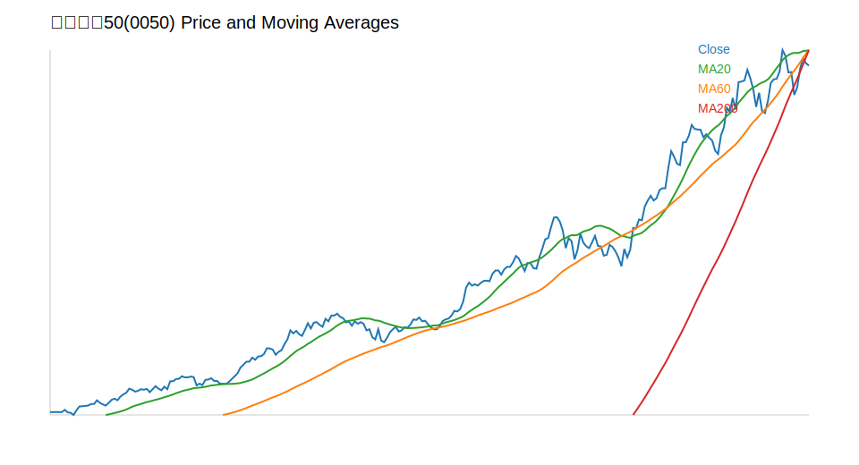

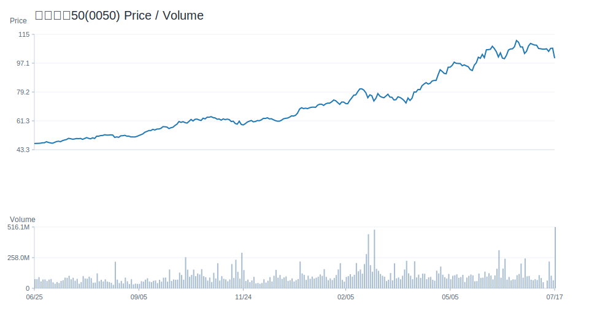

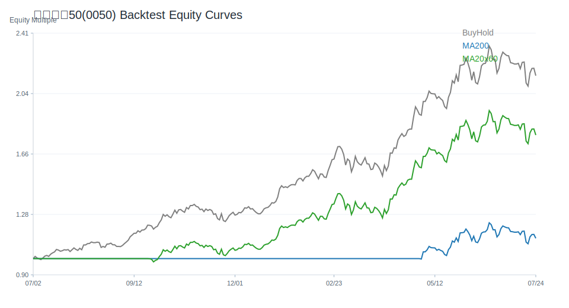

## 台積電(2330)

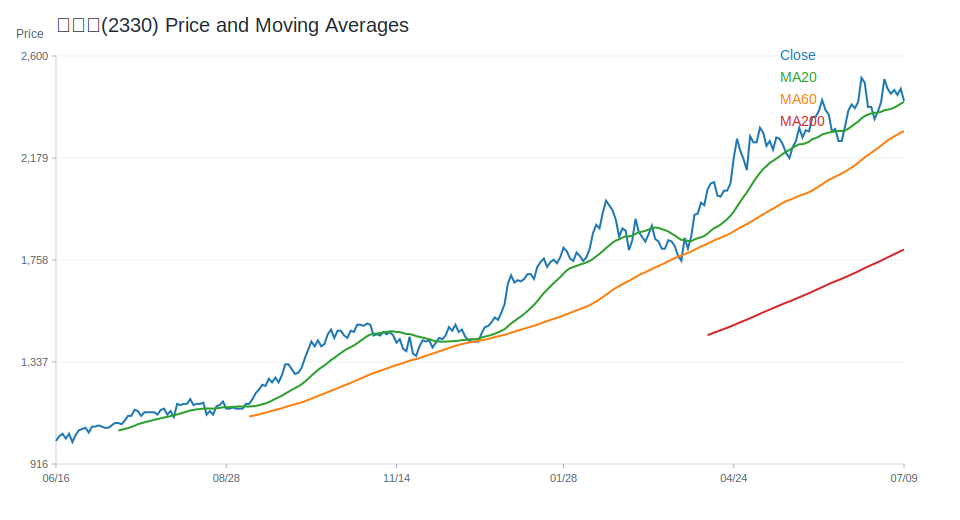

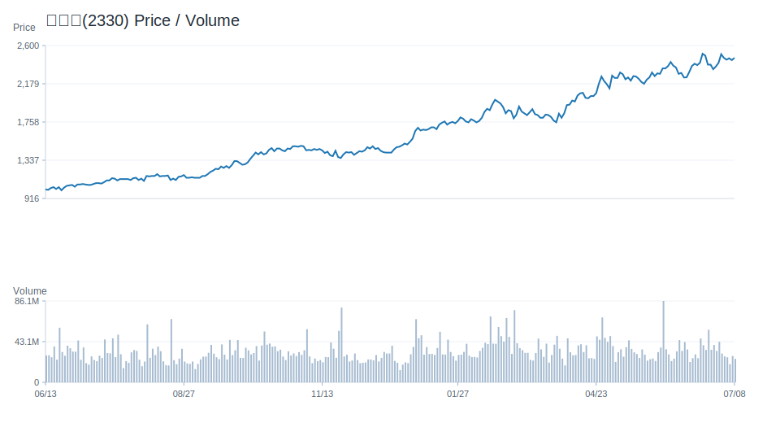

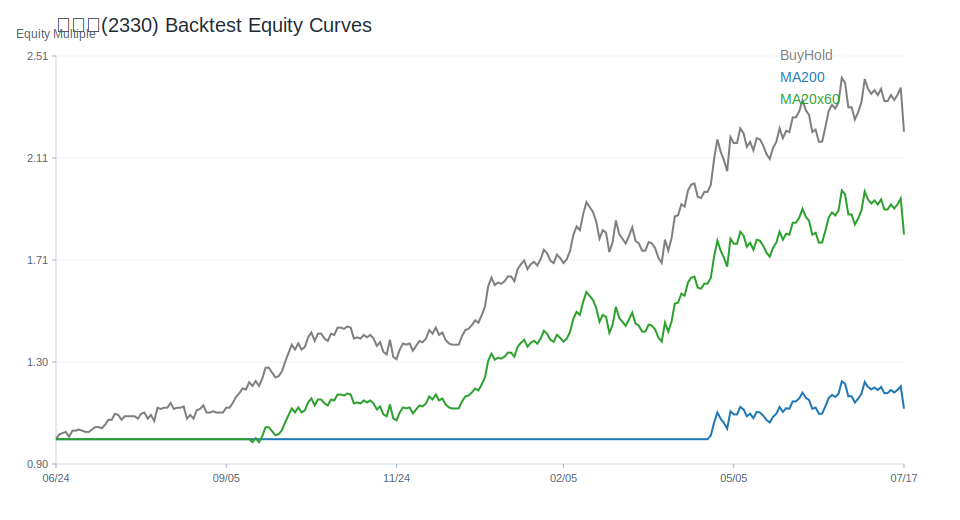

## QQQ

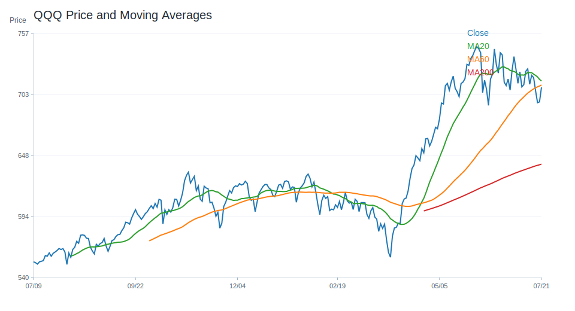

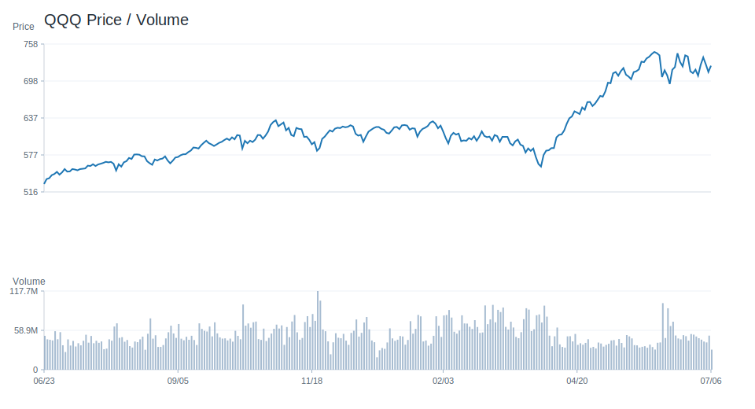

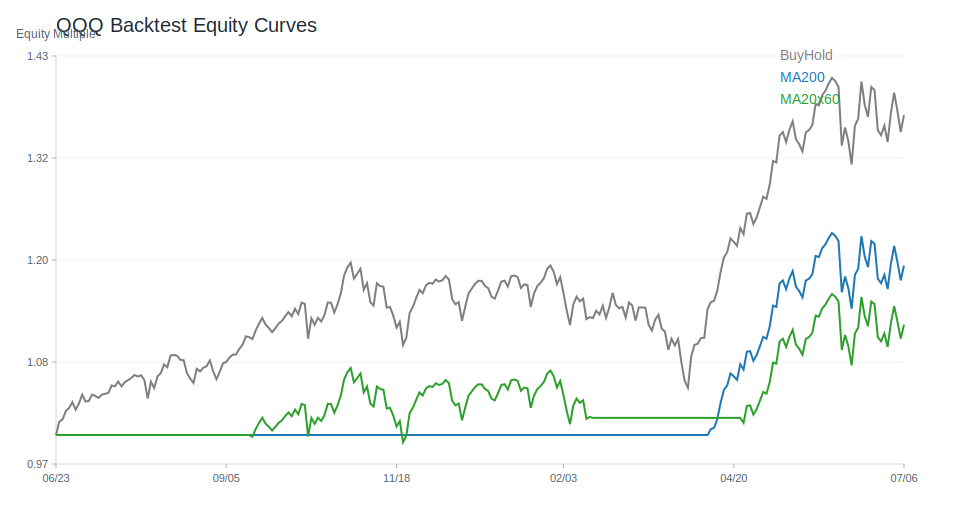

## VOO

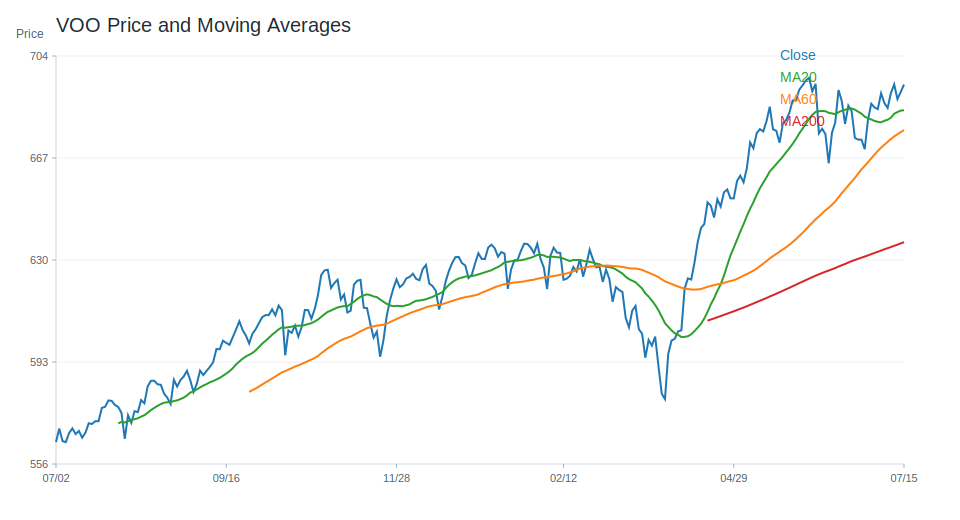

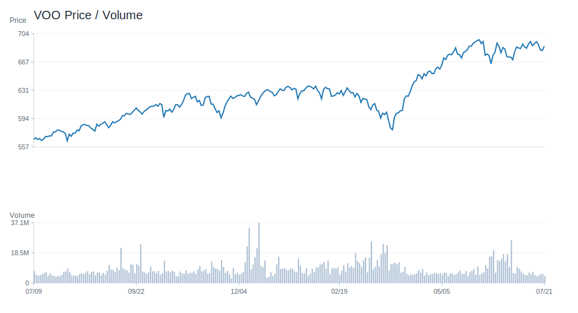

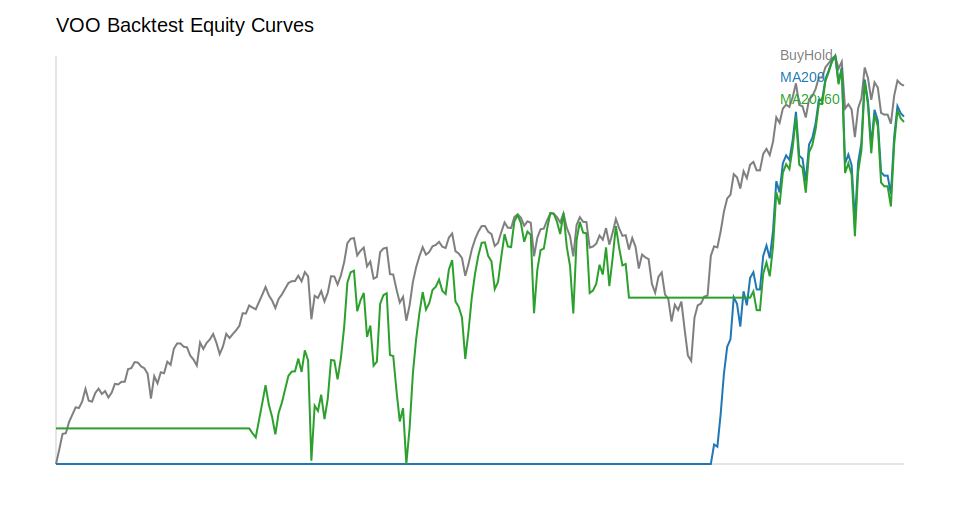

## SOXX

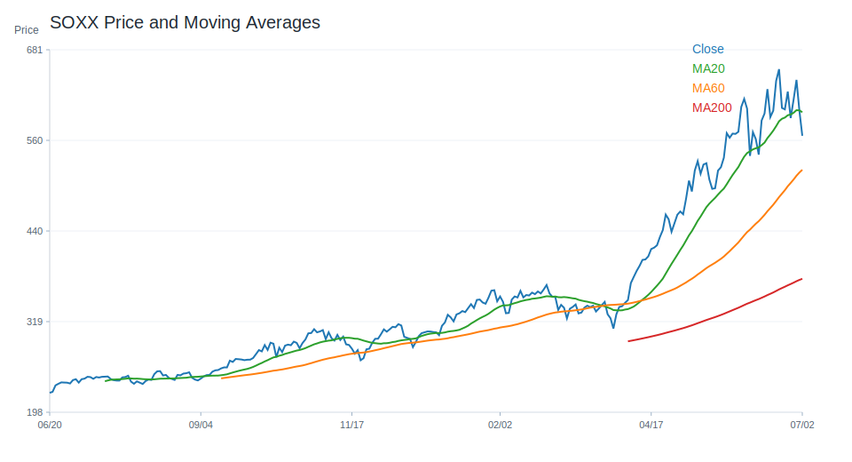

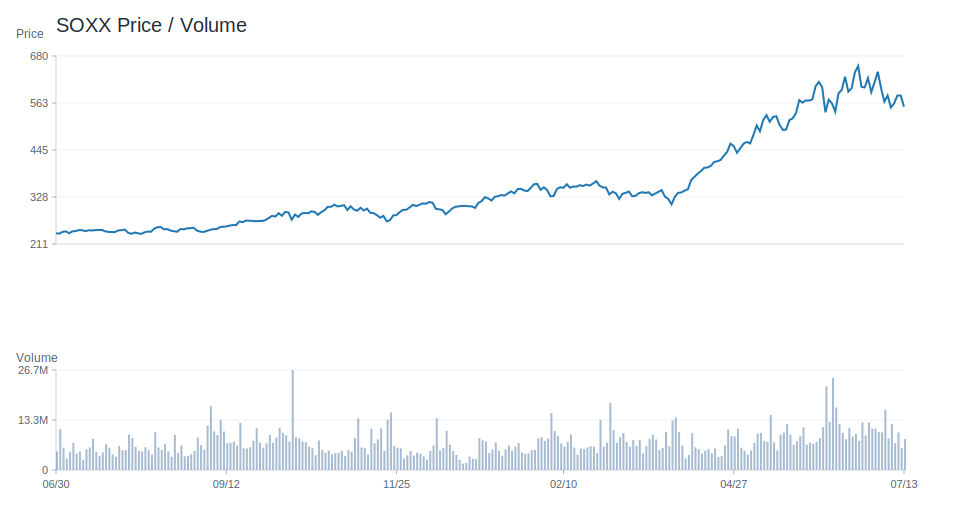

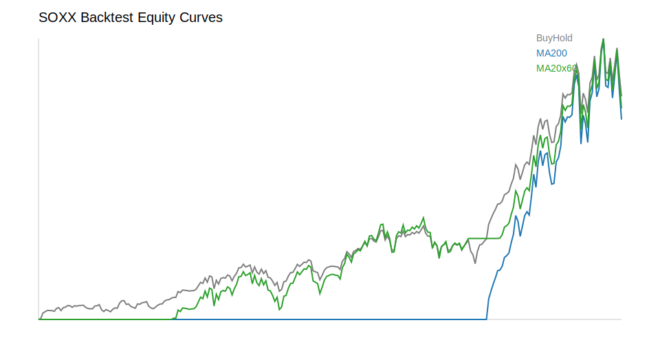

## NVDA

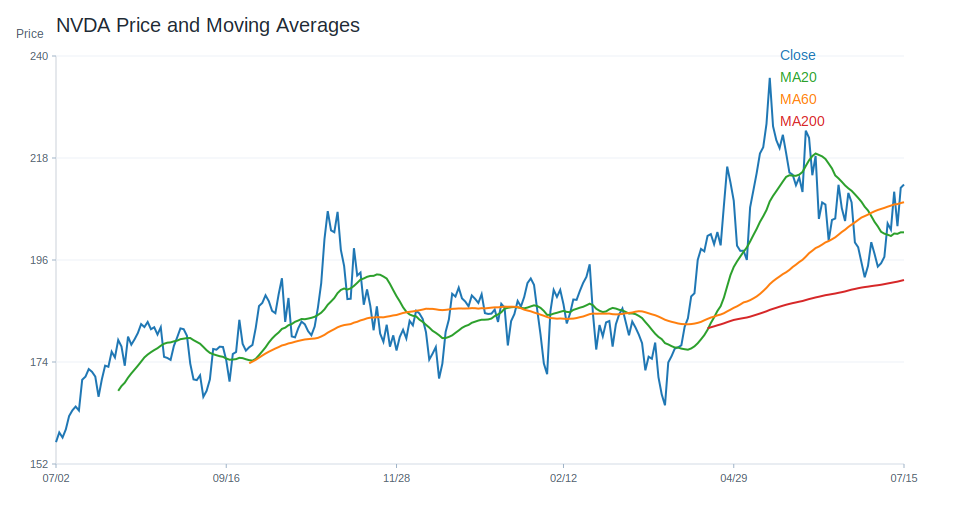

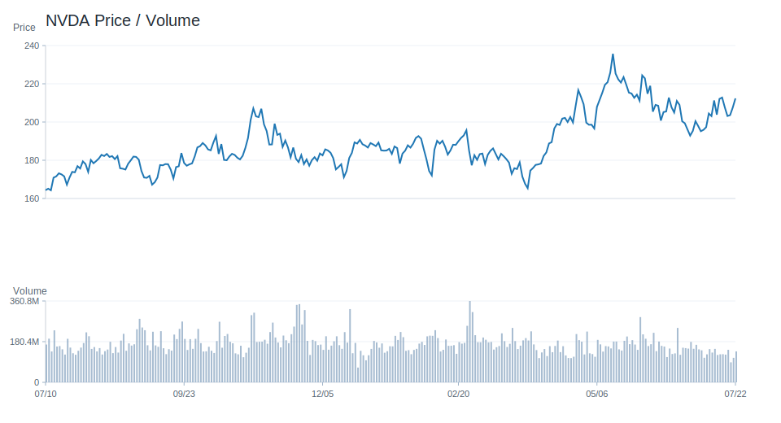

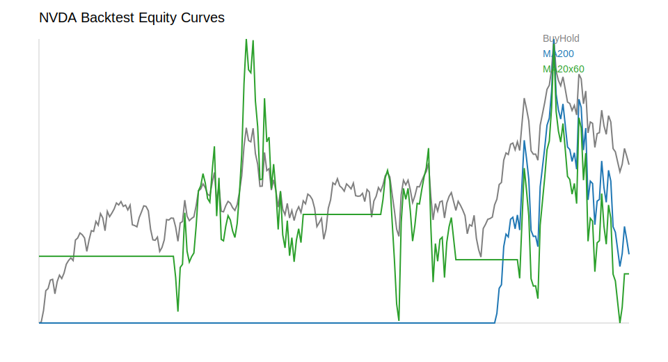

---

# 十、個股研究訊號與觀察等級

研究訊號僅供分析，不是買賣建議。
## 台股
觀察等級較高：
- 南電(8046)：積極觀察；研究訊號 強烈偏多，分數 8。多項量化與事件條件同時偏正向，適合列為優先研究名單。依據：20 日漲幅偏強、60 日趨勢偏強、站上 20 日均線、站上 200 日均線。
- 聯電(2303)：積極觀察；研究訊號 強烈偏多，分數 7。多項量化與事件條件同時偏正向，適合列為優先研究名單。依據：20 日漲幅偏強、60 日趨勢偏強、站上 20 日均線、站上 200 日均線。
- 台積電(2330)：積極觀察；研究訊號 強烈偏多，分數 7。多項量化與事件條件同時偏正向，適合列為優先研究名單。依據：20 日漲幅偏強、60 日趨勢偏強、站上 20 日均線、站上 200 日均線。
- 日月光投控(3711)：積極觀察；研究訊號 強烈偏多，分數 7。多項量化與事件條件同時偏正向，適合列為優先研究名單。依據：20 日漲幅偏強、60 日趨勢偏強、站上 20 日均線、站上 200 日均線。
- 緯穎(6669)：積極觀察；研究訊號 強烈偏多，分數 7。多項量化與事件條件同時偏正向，適合列為優先研究名單。依據：60 日趨勢偏強、站上 20 日均線、站上 200 日均線、RSI 位於中性偏強區。
降低關注 / 風險觀察：
- 欣興(3037)：降低關注；研究訊號 偏空，分數 -4。部分條件偏弱，研究關注度應低於正向標的。依據：20 日跌幅偏弱、60 日趨勢偏強、跌破 20 日均線、站上 200 日均線。
- 鴻海(2317)：維持觀察；研究訊號 中性，分數 -2。正負條件尚未形成明確方向，維持一般追蹤。依據：20 日跌幅偏弱、60 日趨勢偏強、跌破 20 日均線、站上 200 日均線。
- 技嘉(2376)：維持觀察；研究訊號 中性，分數 -2。正負條件尚未形成明確方向，維持一般追蹤。依據：20 日跌幅偏弱、60 日趨勢偏強、跌破 20 日均線、站上 200 日均線。
- 主動統一台股增長(00981A)：維持觀察；研究訊號 中性，分數 -1。正負條件尚未形成明確方向，維持一般追蹤。依據：60 日趨勢偏強、跌破 20 日均線、站上 200 日均線、MACD histogram 為負。
- 台達電(2308)：維持觀察；研究訊號 中性，分數 -1。正負條件尚未形成明確方向，維持一般追蹤。依據：20 日跌幅偏弱、跌破 20 日均線、站上 200 日均線、MACD histogram 為負。
## 美股
觀察等級較高：
- AAPL：積極觀察；研究訊號 強烈偏多，分數 8。多項量化與事件條件同時偏正向，適合列為優先研究名單。依據：60 日趨勢偏強、站上 20 日均線、站上 200 日均線、RSI 位於中性偏強區。
- VOO：積極觀察；研究訊號 強烈偏多，分數 8。多項量化與事件條件同時偏正向，適合列為優先研究名單。依據：60 日趨勢偏強、站上 20 日均線、站上 200 日均線、RSI 位於中性偏強區。
- AMZN：積極觀察；研究訊號 強烈偏多，分數 7。多項量化與事件條件同時偏正向，適合列為優先研究名單。依據：60 日趨勢偏強、站上 20 日均線、站上 200 日均線、RSI 位於中性偏強區。
- GOOGL：積極觀察；研究訊號 強烈偏多，分數 6。多項量化與事件條件同時偏正向，適合列為優先研究名單。依據：60 日趨勢偏強、站上 20 日均線、站上 200 日均線、RSI 位於中性偏強區。
- QQQ：積極觀察；研究訊號 強烈偏多，分數 6。多項量化與事件條件同時偏正向，適合列為優先研究名單。依據：60 日趨勢偏強、站上 20 日均線、站上 200 日均線、RSI 位於中性偏強區。
降低關注 / 風險觀察：
- ORCL：高風險觀察；研究訊號 強烈偏空，分數 -7。多項條件偏弱或風險較高，研究上需提高風險意識。依據：20 日跌幅偏弱、跌破 20 日均線、跌破 200 日均線、RSI 偏弱。
- CRM：維持觀察；研究訊號 中性，分數 -2。正負條件尚未形成明確方向，維持一般追蹤。依據：20 日跌幅偏弱、站上 20 日均線、跌破 200 日均線、RSI 位於中性偏強區。
- NFLX：維持觀察；研究訊號 中性，分數 -1。正負條件尚未形成明確方向，維持一般追蹤。依據：20 日跌幅偏弱、60 日趨勢偏弱、跌破 20 日均線、跌破 200 日均線。
- NVDA：維持觀察；研究訊號 中性，分數 -1。正負條件尚未形成明確方向，維持一般追蹤。依據：20 日跌幅偏弱、跌破 20 日均線、站上 200 日均線、MACD histogram 為負。
- ASML：維持觀察；研究訊號 中性，分數 0。正負條件尚未形成明確方向，維持一般追蹤。依據：60 日趨勢偏強、跌破 20 日均線、站上 200 日均線、RSI 位於中性偏強區。

---

# 十一、結論

目前市場偏向：偏多。

原因：綜合評分 5；0050 20 日漲跌與 200 日均線偏多；QQQ 事件新聞偏多；新聞主題偏向 AI、半導體或企業成長；總經風險偏低；QQQ 200 日均線策略歷史風險報酬較佳。

不得提供投資建議。

所有分析僅供研究用途。

---

## 系統狀態

- 回測狀態：已取得資料
- 研究用途：research_only
- 投資建議：否

## 回測摘要

回測假設：交易成本 0.10%；策略使用前一交易日訊號承擔下一交易日報酬，避免偷看未來資料。
回測僅為歷史資料研究，不代表未來績效，也不是投資建議。
策略說明：
- price_above_ma200：收盤價高於 200 日均線時持有，否則空手。
- ma20_cross_ma60：20 日均線高於 60 日均線時持有，否則空手。
- buy_and_hold：買入持有基準，用於比較策略是否優於單純持有。
台股回測標的數：23
- 200 日均線策略 Sharpe 前五：元大台灣50(0050)(Sharpe 1.83, CAGR 39.22%, MDD -21.30%, 交易 3 次, 均持有 246.33 日)、主動統一台股增長(00981A)(Sharpe 1.82, CAGR 47.91%, MDD -9.14%, 交易 1 次, 均持有 80.0 日)、奇鋐(3017)(Sharpe 1.74, CAGR 107.22%, MDD -42.26%, 交易 7 次, 均持有 100.43 日)、元大高股息(0056)(Sharpe 1.65, CAGR 23.75%, MDD -17.70%, 交易 9 次, 均持有 75.78 日)、中信金(2891)(Sharpe 1.61, CAGR 35.48%, MDD -17.86%, 交易 4 次, 均持有 193.25 日)
- 20/60 均線策略 Sharpe 前五：主動統一台股增長(00981A)(Sharpe 2.75, CAGR 125.51%, MDD -9.14%, 交易 1 次, 均持有 220.0 日)、台達電(2308)(Sharpe 1.62, CAGR 64.10%, MDD -27.80%, 交易 9 次, 均持有 73.11 日)、元大台灣50(0050)(Sharpe 1.61, CAGR 33.65%, MDD -21.30%, 交易 6 次, 均持有 121.17 日)、奇鋐(3017)(Sharpe 1.57, CAGR 86.51%, MDD -30.69%, 交易 8 次, 均持有 84.62 日)、台積電(2330)(Sharpe 1.46, CAGR 40.83%, MDD -24.54%, 交易 6 次, 均持有 121.33 日)
美股回測標的數：20
- 200 日均線策略 Sharpe 前五：MU(Sharpe 1.59, CAGR 86.02%, MDD -56.04%, 交易 11 次, 均持有 56.82 日)、VOO(Sharpe 1.35, CAGR 14.73%, MDD -10.35%, 交易 5 次, 均持有 148.4 日)、QQQ(Sharpe 1.34, CAGR 21.04%, MDD -13.56%, 交易 4 次, 均持有 186.0 日)、TSM(Sharpe 1.33, CAGR 46.38%, MDD -23.30%, 交易 8 次, 均持有 89.0 日)、NVDA(Sharpe 1.31, CAGR 55.29%, MDD -29.35%, 交易 5 次, 均持有 146.6 日)
- 20/60 均線策略 Sharpe 前五：MU(Sharpe 1.50, CAGR 78.93%, MDD -36.17%, 交易 10 次, 均持有 67.7 日)、NVDA(Sharpe 1.46, CAGR 63.37%, MDD -27.12%, 交易 7 次, 均持有 95.29 日)、TSM(Sharpe 1.27, CAGR 41.78%, MDD -22.56%, 交易 8 次, 均持有 86.5 日)、META(Sharpe 1.24, CAGR 39.37%, MDD -25.19%, 交易 8 次, 均持有 79.5 日)、AAPL(Sharpe 1.06, CAGR 17.54%, MDD -15.23%, 交易 8 次, 均持有 68.25 日)
