# 每日市場研究報告

日期：2026-08-25

> 本報告僅供研究用途，不構成任何投資建議。

---

# 一、市場概況

今日全球市場重點：

- 台股：已取得資料
- 美股：已取得資料

市場摘要：已收集 88 個市場資料檔案。

- 台股：已統計 23 個標的；20 日相對強勢：欣興(3037)(43.32%)、奇鋐(3017)(31.70%)、華碩(2357)(25.85%)、世芯-KY(3661)(24.08%)、緯穎(6669)(21.17%)
- 美股：已統計 20 個標的；20 日相對強勢：MSFT(25.01%)、ORCL(20.67%)、TSLA(13.92%)、MU(13.70%)、NFLX(13.59%)

---

# 二、台股分析

## 大盤

台股觀察清單，以下列出前 12 個標的：
- 元大台灣50(0050)：收盤 103.80；20 日 2.32%；60 日 -1.52%；200 日均線之上：是
- 富邦科技(0052)：收盤 60.55；20 日 2.11%；60 日 -1.54%；200 日均線之上：否
- 元大高股息(0056)：收盤 52.30；20 日 4.60%；60 日 4.18%；200 日均線之上：是
- 主動統一台股增長(00981A)：收盤 28.47；20 日 3.41%；60 日 -9.73%；200 日均線之上：是
- 聯電(2303)：收盤 125.00；20 日 10.13%；60 日 -14.38%；200 日均線之上：是
- 台達電(2308)：收盤 1710.00；20 日 8.23%；60 日 -29.34%；200 日均線之上：是
- 鴻海(2317)：收盤 243.00；20 日 2.10%；60 日 -17.21%；200 日均線之上：是
- 台積電(2330)：收盤 2400.00；20 日 5.26%；60 日 1.91%；200 日均線之上：是
- 華碩(2357)：收盤 925.00；20 日 25.85%；60 日 10.51%；200 日均線之上：是
- 技嘉(2376)：收盤 347.50；20 日 6.27%；60 日 -10.21%；200 日均線之上：是
- 廣達(2382)：收盤 328.50；20 日 4.78%；60 日 -11.81%；200 日均線之上：是
- 中華電(2412)：收盤 136.50；20 日 -3.19%；60 日 -2.85%；200 日均線之上：是
- 其餘 11 個標的已納入統計與強弱排行。

## 成交量

量價分析標的數：23
- 量價偏多觀察：富邦金(2881)(價漲量增, 分數 3, 5 日 9.27%, 量比 2.23x)、聯電(2303)(量能中性, 分數 2, 5 日 5.04%, 量比 0.77x)、華碩(2357)(量縮整理, 分數 2, 5 日 1.65%, 量比 0.42x)、國泰金(2882)(價漲量增, 分數 2, 5 日 3.83%, 量比 1.35x)、奇鋐(3017)(量能中性, 分數 2, 5 日 -2.80%, 量比 0.64x)
- 量價偏弱觀察：元大台灣50(0050)(量能中性, 分數 -1, 5 日 -2.49%, 量比 0.29x)、富邦科技(0052)(量能中性, 分數 -1, 5 日 -2.02%, 量比 0.30x)、鴻海(2317)(量能中性, 分數 -1, 5 日 -2.41%, 量比 0.70x)、中華電(2412)(量縮整理, 分數 -1, 5 日 -0.36%, 量比 0.39x)、日月光投控(3711)(量縮整理, 分數 -1, 5 日 -1.34%, 量比 0.59x)

## 類股輪動

MVP 尚未接入完整類股分類資料，暫不推論類股輪動。

## 強勢股

欣興(3037)(43.32%)、奇鋐(3017)(31.70%)、華碩(2357)(25.85%)、世芯-KY(3661)(24.08%)、緯穎(6669)(21.17%)

## 弱勢股

中華電(2412)(-3.19%)、鴻海(2317)(2.10%)、富邦科技(0052)(2.11%)、元大台灣50(0050)(2.32%)、中信金(2891)(3.37%)

---

# 三、美股分析

## 主要 ETF

- QQQ：收盤 710.72；20 日 5.22%；60 日 -3.74%；200 日均線之上：是
- VOO：收盤 704.02；20 日 3.39%；60 日 1.23%；200 日均線之上：是
- VT：收盤 160.99；20 日 4.30%；60 日 1.82%；200 日均線之上：是
- SOXX：收盤 514.06；20 日 4.60%；60 日 -9.67%；200 日均線之上：是

## 科技股

- NVDA：收盤 213.05；20 日 8.14%；60 日 0.90%；200 日均線之上：是
- AAPL：收盤 309.90；20 日 -8.87%；60 日 -0.69%；200 日均線之上：是
- MSFT：收盤 491.71；20 日 25.01%；60 日 9.21%；200 日均線之上：是
- TSM：收盤 417.41；20 日 6.40%；60 日 -0.25%；200 日均線之上：是

## 半導體

- SOXX：收盤 514.06；20 日 4.60%；60 日 -9.67%；200 日均線之上：是
- NVDA：收盤 213.05；20 日 8.14%；60 日 0.90%；200 日均線之上：是
- TSM：收盤 417.41；20 日 6.40%；60 日 -0.25%；200 日均線之上：是

## AI 概念股

目前以 NVDA、MSFT、TSM 作為 AI 相關觀察清單，不擴大推論到未納入資料的標的。

---

# 四、技術分析

技術分析狀態：已取得資料

AI 不重新計算 RSI、MACD、EMA、KD、ATR、ADX，只解讀 Python 輸出的結果。

Python 已提供價格趨勢統計，包括 1 日、5 日、20 日、60 日、252 日漲跌幅，以及 20/60/200 日均線位置與 52 週高低點距離。

Python 也已計算 RSI(14)、MACD(12/26/9)、EMA(20/50/200)、KD(9)、Bollinger Bands(20, 2)、ATR(14)、ADX(14)。

- 元大台灣50(0050)：RSI14 50.37；MACD hist 0.08；K/D 36.94/51.05；ADX 9.80；布林上/中/下 110.03/102.68/95.33
- 台積電(2330)：RSI14 52.24；MACD hist 1.61；K/D 49.65/49.53；ADX 6.73；布林上/中/下 2490.49/2368.50/2246.51
- QQQ：RSI14 48.95；MACD hist -1.12；K/D 24.74/35.84；ADX 14.70；布林上/中/下 746.16/712.16/678.16
- VOO：RSI14 54.23；MACD hist -1.25；K/D 20.40/29.46；ADX 16.38；布林上/中/下 724.97/703.01/681.04
- SOXX：RSI14 44.09；MACD hist -1.47；K/D 22.20/32.79；ADX 15.61；布林上/中/下 568.29/525.75/483.21
- NVDA：RSI14 49.61；MACD hist -1.26；K/D 21.32/31.53；ADX 16.96；布林上/中/下 234.07/214.58/195.09

## 量價分析

Python 已依成交量與價格變化產生量價型態，AI 只解讀輸出結果。

- 元大台灣50(0050)：量能中性；5 日 -2.49%；20 日 2.32%；量比 20 日均量 0.29 倍；OBV 20 日量壓 -33.66%；說明：量價未出現明確偏多或偏空結構、近 5 日均量低於 20 日均量
- 台積電(2330)：量縮整理；5 日 0.84%；20 日 5.26%；量比 20 日均量 0.52 倍；OBV 20 日量壓 14.92%；說明：價格震盪不大且成交量偏低、近 5 日均量低於 20 日均量
- QQQ：量縮整理；5 日 -0.95%；20 日 5.22%；量比 20 日均量 0.62 倍；OBV 20 日量壓 -1.93%；說明：價格震盪不大且成交量偏低
- VOO：量縮整理；5 日 -0.20%；20 日 3.39%；量比 20 日均量 0.69 倍；OBV 20 日量壓 2.15%；說明：價格震盪不大且成交量偏低、近 5 日均量高於 20 日均量
- SOXX：量能中性；5 日 -3.26%；20 日 4.60%；量比 20 日均量 0.71 倍；OBV 20 日量壓 16.77%；說明：量價未出現明確偏多或偏空結構、近 5 日均量低於 20 日均量
- NVDA：量能中性；5 日 -3.04%；20 日 8.14%；量比 20 日均量 1.05 倍；OBV 20 日量壓 -2.19%；說明：量價未出現明確偏多或偏空結構、20 日價格趨勢偏強

---

# 五、新聞分析

新聞分析狀態：已取得資料

最近 30 天 RSS 收集結果：財經新聞 89 則，科技新聞 30 則，台灣財經新聞 199 則。

新聞摘要：最近新聞共 318 則；主要分類分布為 ai_semiconductor:206、other:90、earnings_business:22；高頻關鍵字包含 AI、台股、台積電、半導體、Nvidia、Apple、Trump、外資。

分類統計：AI / 半導體:206、總經 / 利率:17、財報 / 企業:22、市場風險:18、其他:90

高頻關鍵字：AI(203)、台股(62)、台積電(55)、半導體(22)、Nvidia(11)、Apple(11)、Trump(8)、外資(7)、晶片(6)、財報(6)

代表新聞：

- [CNBC Finance] SpaceX plans to build a $100 billion spaceport in Louisiana (Tue, 25 Aug 2026 22:09:01 GMT)
- [Google News 台股] 【台股08/26日盤前分析】 - 理財周刊 (Tue, 25 Aug 2026 22:02:26 GMT)
- [CNBC Finance] Here's why markets are starting to care about the 2026 election 10 weeks out (Tue, 25 Aug 2026 21:54:51 GMT)
- [CNBC Finance] Waymo to launch driverless rides in Germany in 2027, entering third market outside U.S. (Tue, 25 Aug 2026 21:47:29 GMT)
- [CNBC Finance] Canada unveils retaliatory tariffs on about $20 billion of U.S. goods (Tue, 25 Aug 2026 21:26:01 GMT)
- [CNBC Finance] OpenAI data center chief Chris Malone is out, the latest in a string of executive exits (Tue, 25 Aug 2026 21:26:00 GMT)
- [Google News 台股] 【盤前】外資狠砍1.5萬張！國家隊砸逾2億護鴻海 - Yahoo新聞 (Tue, 25 Aug 2026 21:15:00 GMT)
- [CNBC Finance] Is the K-shaped economy ending? Finance pros weigh in (Tue, 25 Aug 2026 21:05:27 GMT)

分析：

- 市場影響：可依新聞分類與高頻關鍵字判斷市場關注焦點。
- 利多：若 AI / 半導體、企業財報與展望新聞占比提高，偏向成長題材支撐。
- 利空：若總經利率、波動、地緣政治與衰退新聞占比提高，需提高風險意識。

## 事件影響

依新聞標題與摘要的標的別名、產業主題與事件關鍵字進行規則式匹配。
### 台股
- 事件支撐觀察：台積電(2330)(事件偏多, 分數 5, 新聞 56 則)、元大台灣50(0050)(事件偏多, 分數 4, 新聞 67 則)、富邦科技(0052)(事件偏多, 分數 4, 新聞 67 則)、元大高股息(0056)(事件偏多, 分數 4, 新聞 67 則)、主動統一台股增長(00981A)(事件偏多, 分數 4, 新聞 67 則)
- 事件風險觀察：資料不足
- 台積電(2330)：事件偏多，分數 5，匹配新聞 56 則，主題 AI / 半導體:56、財報 / 企業:4；代表新聞：[不只台積電領軍！台股強彈逾400點「這幾檔」也發威 金控雙雄助攻有感 - Yahoo股市](https://news.google.com/rss/articles/CBMiqANBVV95cUxNNFNUSk9nblVOZzBOLUxZUkpjRTdNMGRoTDhDOEx3X1JWRnhxT2d0elh3eWEya3dJUGtsUjVvLURPVWxhX3QxWVZraEFQX0lXVlpaSjlVY1dYT1VORm41S2wzZ0FhaUtubDI0MkZUQ2ZOQTFoOVM3cGhRVVI5bnhqakFYTlBwNUkxeXBCVFVHa2w3a2UteHVvWWFPcTdGSExpRTdYYkt1djN6eHRtQUFiOUZubjRzVXJBY3g1elZxUTcyS0R1LS0tS1RncmdOZHdULUdwWk9kNXZXcHpnTjdfX3ptcGJ2azdkWnRuZFhYZ0xZc2lYdmpqOThEZkQtLWhBT0NDN014a2dMNm1mc0EzdzB0Z2VQdmZTMU14b2RmaW5oM1pUSjhuZVUzZzY2aUFKbDdSWDNybzQ3RURIREFGVTE2eDJQaWtpRWo0OEUwRnNVU2lIdlM3dGMzY0J2blI1NW1QR1JaSkpmZzRJQ0w5YklXOUdGQlNIUVQwY0lKTnlzMDMzblN2S3k2NU0zdldXRWFaT1pCdTUxMlByWGg0ZkV1Ty1tT05m?oc=5)
- 元大台灣50(0050)：事件偏多，分數 4，匹配新聞 67 則，主題 台股 / ETF:67、AI / 半導體:26、財報 / 企業:4、市場風險:2、總經 / 利率:1；代表新聞：[台股回測季線強彈 光通訊助攻 - Yahoo新聞](https://news.google.com/rss/articles/CBMi8AFBVV95cUxQNHNuRkxCdVVrQktiZjktVURHdFZvU0ZJR2M3eTl2d2M5MFYwNlFfUkZRVnFidFg5SGYyeXhoeTVhejktMkRabE0yLTZ6N3VJSDlaQ096UnZoMkpWMHZUbkdBQm1zTzctWW16SzRabFB6RjdOQkJjQ2swN01WelBmSndXUEJFbkt5cWhwNmdIMTFGNFptZVR0NEVmREhYa1dOOUxSQVQzNjdRMDVOR1ExMmJHeWZZbHpNQzkzeGxyaWJGcGVuZ1BBV2dxdUhZV2paYlNINHk4SEozUnpNd2ZJTE1FVWpfT2JWaXdNYUZDXzQ?oc=5)
- 富邦科技(0052)：事件偏多，分數 4，匹配新聞 67 則，主題 台股 / ETF:67、AI / 半導體:26、財報 / 企業:4、市場風險:2、總經 / 利率:1；代表新聞：[台股回測季線強彈 光通訊助攻 - Yahoo新聞](https://news.google.com/rss/articles/CBMi8AFBVV95cUxQNHNuRkxCdVVrQktiZjktVURHdFZvU0ZJR2M3eTl2d2M5MFYwNlFfUkZRVnFidFg5SGYyeXhoeTVhejktMkRabE0yLTZ6N3VJSDlaQ096UnZoMkpWMHZUbkdBQm1zTzctWW16SzRabFB6RjdOQkJjQ2swN01WelBmSndXUEJFbkt5cWhwNmdIMTFGNFptZVR0NEVmREhYa1dOOUxSQVQzNjdRMDVOR1ExMmJHeWZZbHpNQzkzeGxyaWJGcGVuZ1BBV2dxdUhZV2paYlNINHk4SEozUnpNd2ZJTE1FVWpfT2JWaXdNYUZDXzQ?oc=5)
- 元大高股息(0056)：事件偏多，分數 4，匹配新聞 67 則，主題 台股 / ETF:67、AI / 半導體:26、財報 / 企業:4、市場風險:2、總經 / 利率:1；代表新聞：[台股回測季線強彈 光通訊助攻 - Yahoo新聞](https://news.google.com/rss/articles/CBMi8AFBVV95cUxQNHNuRkxCdVVrQktiZjktVURHdFZvU0ZJR2M3eTl2d2M5MFYwNlFfUkZRVnFidFg5SGYyeXhoeTVhejktMkRabE0yLTZ6N3VJSDlaQ096UnZoMkpWMHZUbkdBQm1zTzctWW16SzRabFB6RjdOQkJjQ2swN01WelBmSndXUEJFbkt5cWhwNmdIMTFGNFptZVR0NEVmREhYa1dOOUxSQVQzNjdRMDVOR1ExMmJHeWZZbHpNQzkzeGxyaWJGcGVuZ1BBV2dxdUhZV2paYlNINHk4SEozUnpNd2ZJTE1FVWpfT2JWaXdNYUZDXzQ?oc=5)
- 主動統一台股增長(00981A)：事件偏多，分數 4，匹配新聞 67 則，主題 台股 / ETF:67、AI / 半導體:26、財報 / 企業:4、市場風險:2、總經 / 利率:1；代表新聞：[台股回測季線強彈 光通訊助攻 - Yahoo新聞](https://news.google.com/rss/articles/CBMi8AFBVV95cUxQNHNuRkxCdVVrQktiZjktVURHdFZvU0ZJR2M3eTl2d2M5MFYwNlFfUkZRVnFidFg5SGYyeXhoeTVhejktMkRabE0yLTZ6N3VJSDlaQ096UnZoMkpWMHZUbkdBQm1zTzctWW16SzRabFB6RjdOQkJjQ2swN01WelBmSndXUEJFbkt5cWhwNmdIMTFGNFptZVR0NEVmREhYa1dOOUxSQVQzNjdRMDVOR1ExMmJHeWZZbHpNQzkzeGxyaWJGcGVuZ1BBV2dxdUhZV2paYlNINHk4SEozUnpNd2ZJTE1FVWpfT2JWaXdNYUZDXzQ?oc=5)
### 美股
- 事件支撐觀察：SOXX(事件偏多, 分數 5, 新聞 98 則)、QQQ(事件偏多, 分數 3, 新聞 58 則)、VOO(事件偏多, 分數 3, 新聞 58 則)、VT(事件偏多, 分數 3, 新聞 58 則)
- 事件風險觀察：資料不足
- SOXX：事件偏多，分數 5，匹配新聞 98 則，主題 AI / 半導體:98、財報 / 企業:10、總經 / 利率:1；代表新聞：[Why AMD can beat rivals Intel and Nvidia in the market for data-center CPUs](https://www.marketwatch.com/story/why-amd-can-beat-rivals-intel-and-nvidia-in-the-market-for-data-center-cpus-e49a53f1?mod=mw_rss_topstories)
- QQQ：事件偏多，分數 3，匹配新聞 58 則，主題 AI / 半導體:46、財報 / 企業:13、市場風險:4、總經 / 利率:3；代表新聞：[Why AMD can beat rivals Intel and Nvidia in the market for data-center CPUs](https://www.marketwatch.com/story/why-amd-can-beat-rivals-intel-and-nvidia-in-the-market-for-data-center-cpus-e49a53f1?mod=mw_rss_topstories)
- VOO：事件偏多，分數 3，匹配新聞 58 則，主題 AI / 半導體:46、財報 / 企業:13、市場風險:4、總經 / 利率:3；代表新聞：[Why AMD can beat rivals Intel and Nvidia in the market for data-center CPUs](https://www.marketwatch.com/story/why-amd-can-beat-rivals-intel-and-nvidia-in-the-market-for-data-center-cpus-e49a53f1?mod=mw_rss_topstories)
- VT：事件偏多，分數 3，匹配新聞 58 則，主題 AI / 半導體:46、財報 / 企業:13、市場風險:4、總經 / 利率:3；代表新聞：[Why AMD can beat rivals Intel and Nvidia in the market for data-center CPUs](https://www.marketwatch.com/story/why-amd-can-beat-rivals-intel-and-nvidia-in-the-market-for-data-center-cpus-e49a53f1?mod=mw_rss_topstories)

---

# 六、總經分析

總經分析狀態：已取得資料

包含：

- CPI
- 利率
- PMI
- GDP
- VIX
- 美元指數
- 公債殖利率

總經摘要：Fed Funds Rate 3.63，近 3 期趨勢 持平；美國 10 年期公債殖利率 4.639，近 3 期趨勢 連續下降；VIX 15.45，近 3 期趨勢 最近一期下降。整體總經風險分級：medium。
- CPI：332.81（2026-07-01）；前期變化 +0.24 / 0.07%；近 3 期趨勢 最近一期上升；風險 中等
- Fed Funds Rate：3.63（2026-07-01）；前期變化 0.00 / 0.00%；近 3 期趨勢 持平；風險 偏低
- GDP：32475.21（2026-04-01）；前期變化 +609.49 / 1.91%；近 3 期趨勢 連續上升；風險 中等
- 美元指數：118.06（2026-08-21）；前期變化 -0.19 / -0.16%；近 3 期趨勢 連續下降；風險 中等
- PMI：PMI 尚未接入可靠公開資料來源。
- VIX：15.45（2026-08-25）；前期變化 -0.40 / -2.52%；近 3 期趨勢 最近一期下降；風險 偏低
- 美國 10 年期公債殖利率：4.64（2026-08-25）；前期變化 -0.07 / -1.38%；近 3 期趨勢 連續下降；風險 中等
整體總經風險分級：中等

---

# 七、風險分析

目前主要風險：

- 市場風險：依 VIX、均線與短中期漲跌幅觀察
- 總經風險：依利率、美元指數與公債殖利率觀察
- 政策風險：資料來源尚未接入政策事件資料
- 地緣政治：資料來源尚未接入地緣政治事件資料

風險摘要：總經風險分級：中等。

總經風險總評：中等
- Fed Funds Rate：偏低；趨勢 持平；最新值 3.63
- 美元指數：中等；趨勢 連續下降；最新值 118.06
- VIX：偏低；趨勢 最近一期下降；最新值 15.45
- 美國 10 年期公債殖利率：中等；趨勢 連續下降；最新值 4.64

---

# 八、未來觀察重點

接下來應持續關注：

- 財報
- 經濟數據
- Fed
- 國際事件

---

# 九、圖表摘要

以下圖表由 Python 自動產生，包含價格均線、量價關係與回測權益曲線。

## 元大台灣50(0050)

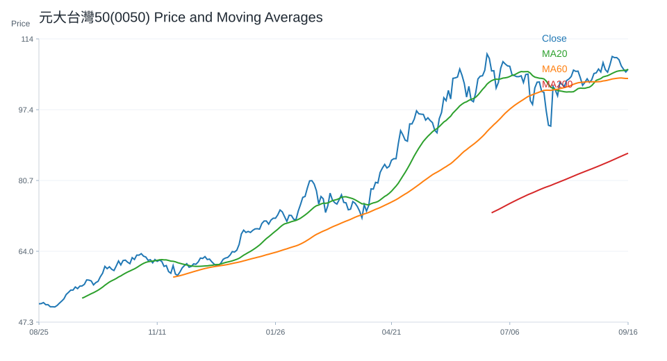

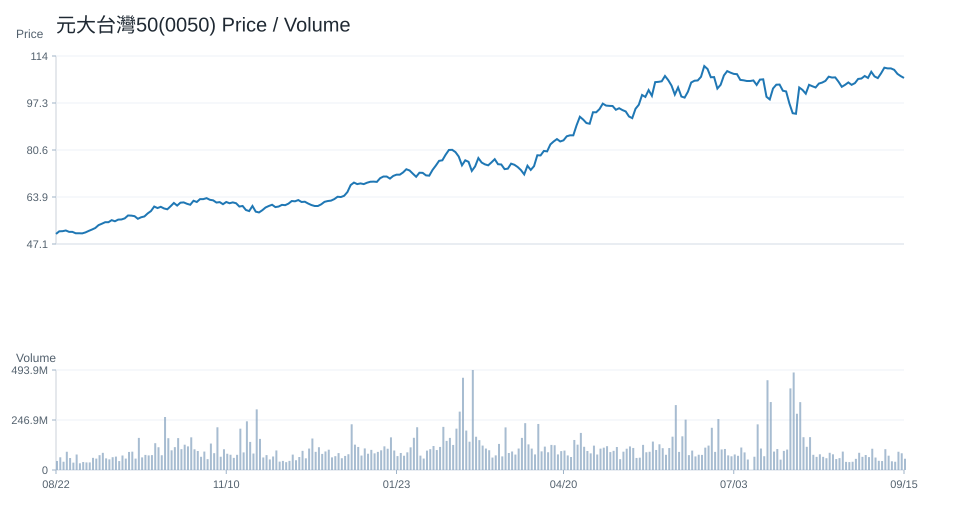

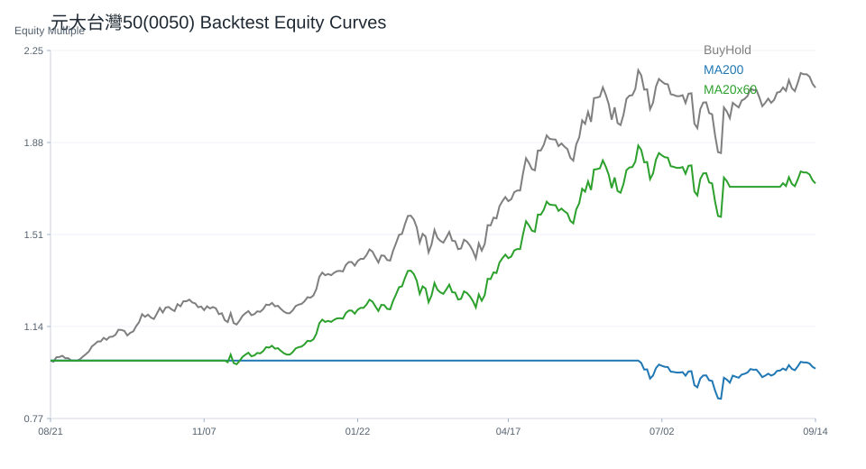

## 台積電(2330)

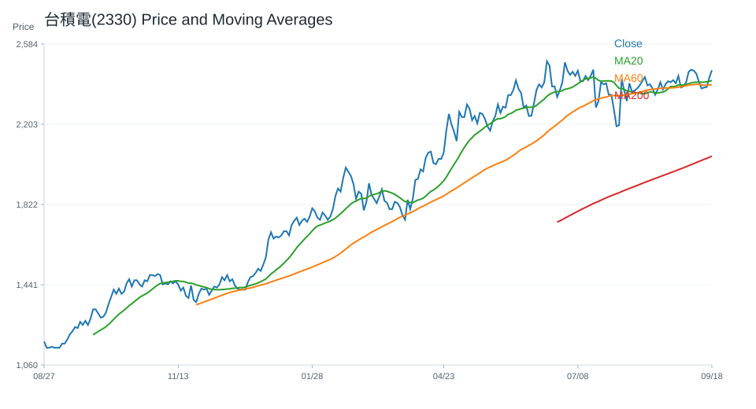

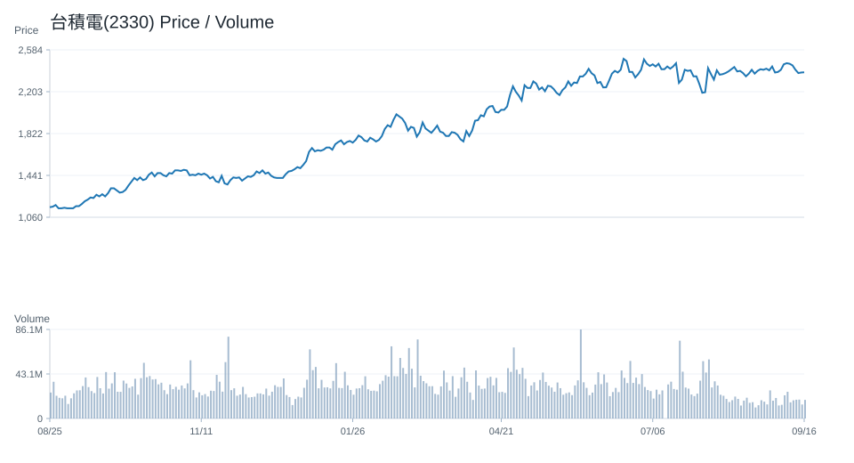

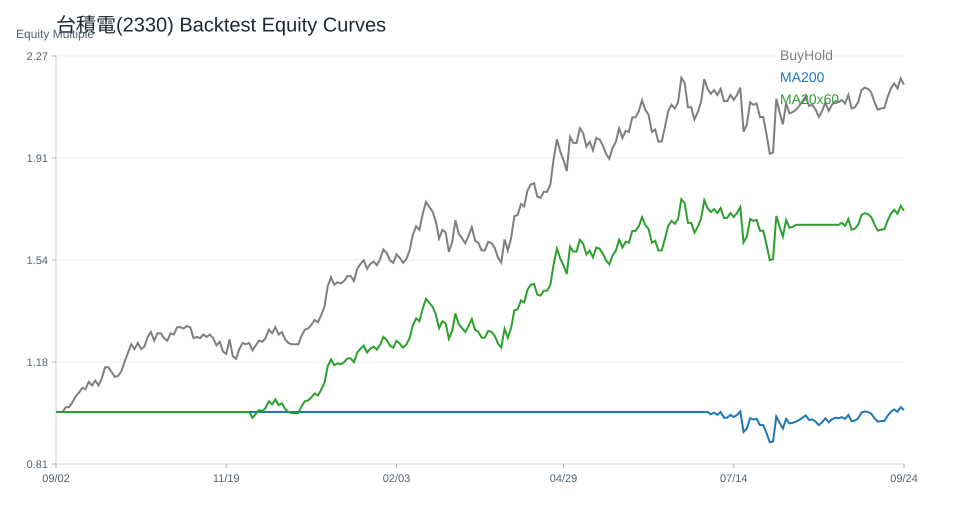

## QQQ

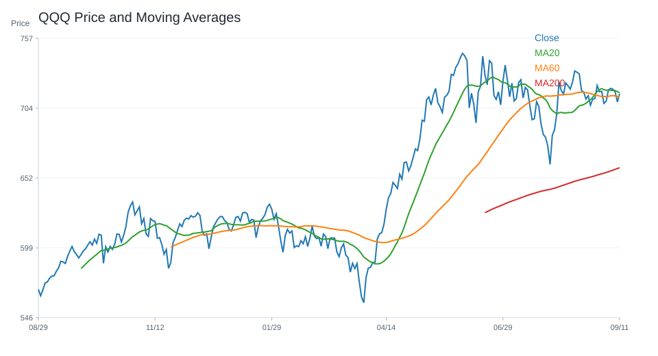

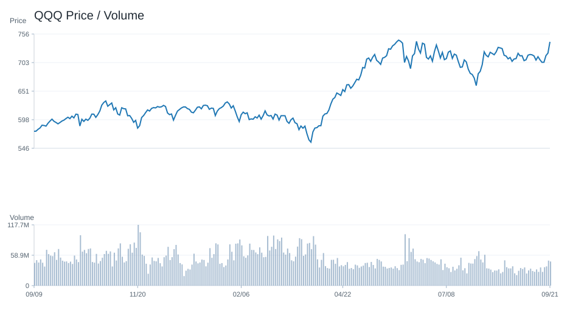

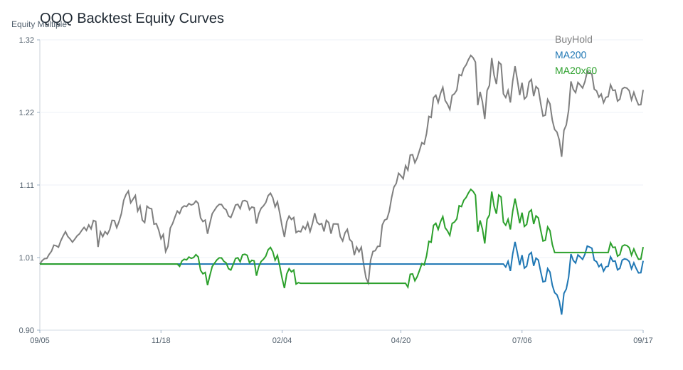

## VOO

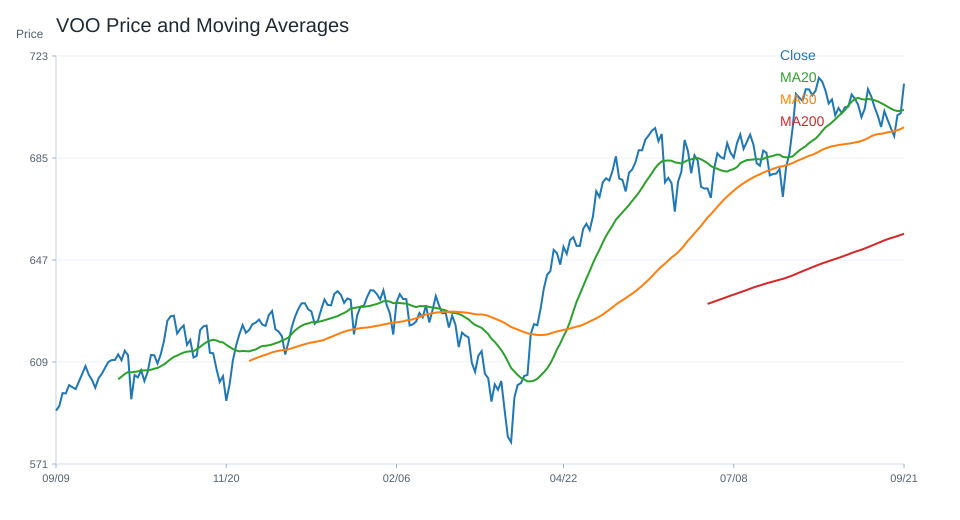

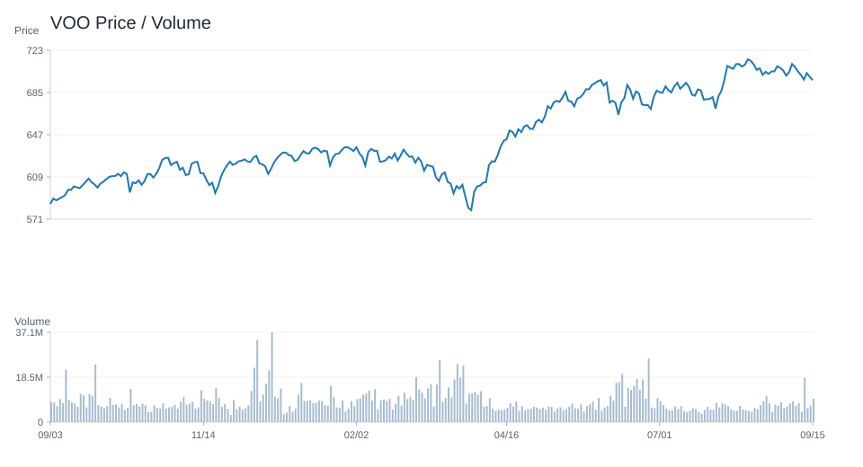

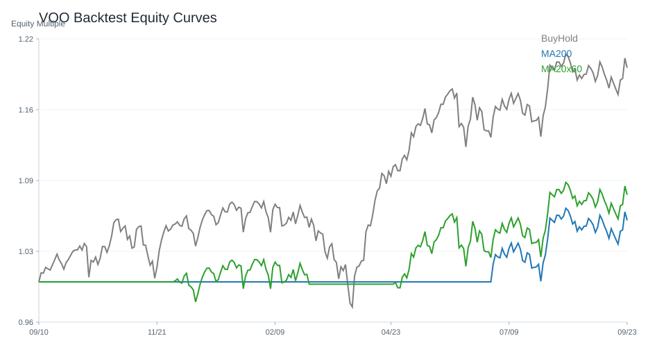

## SOXX

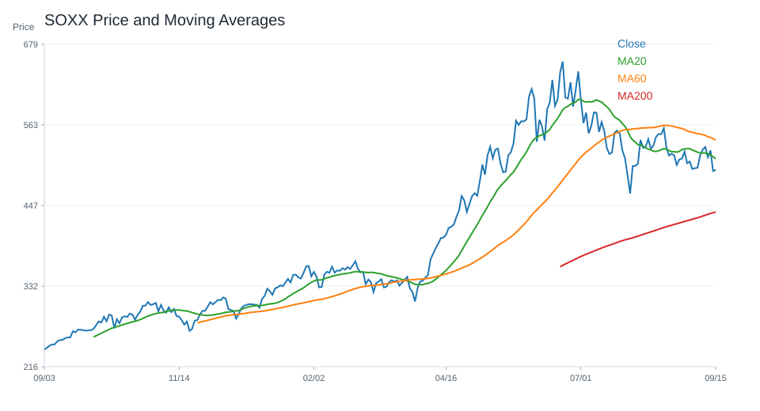

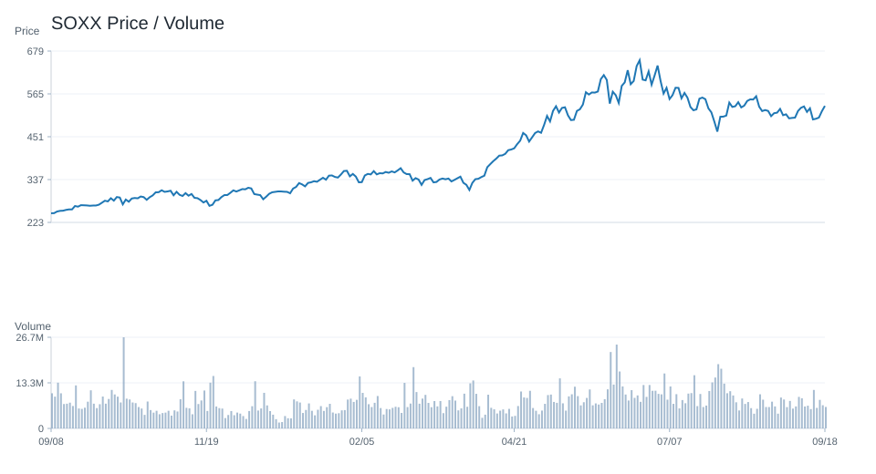

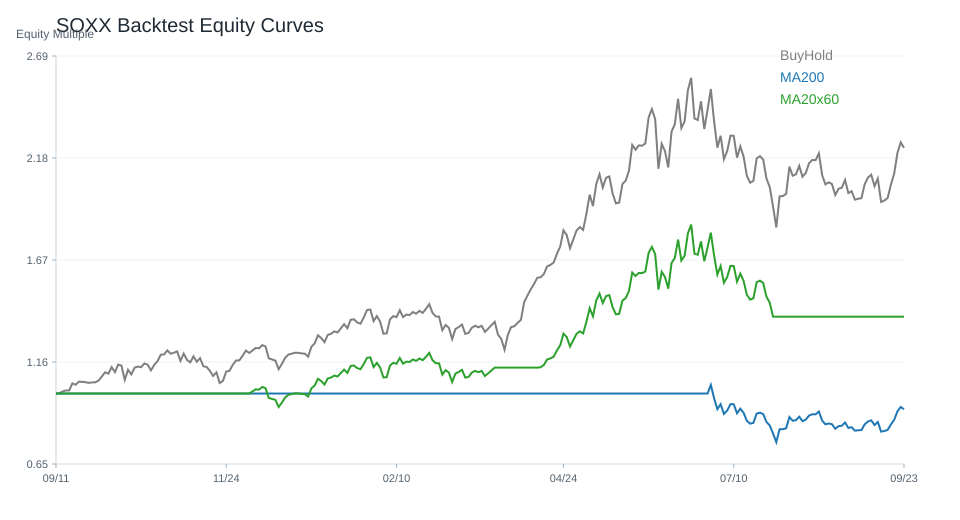

## NVDA

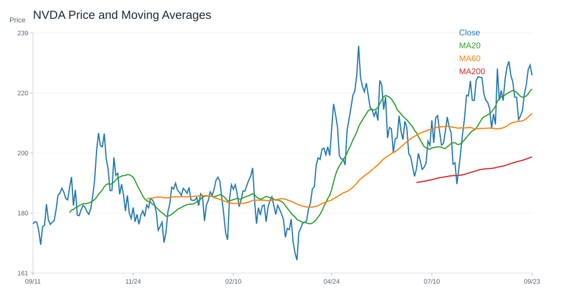

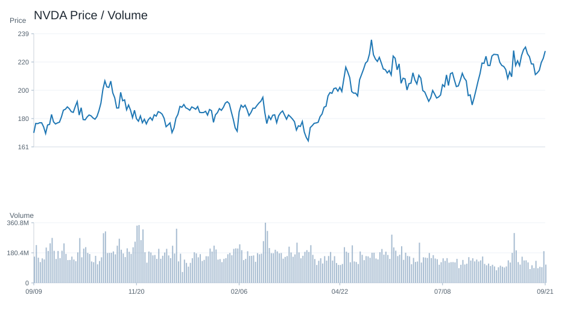

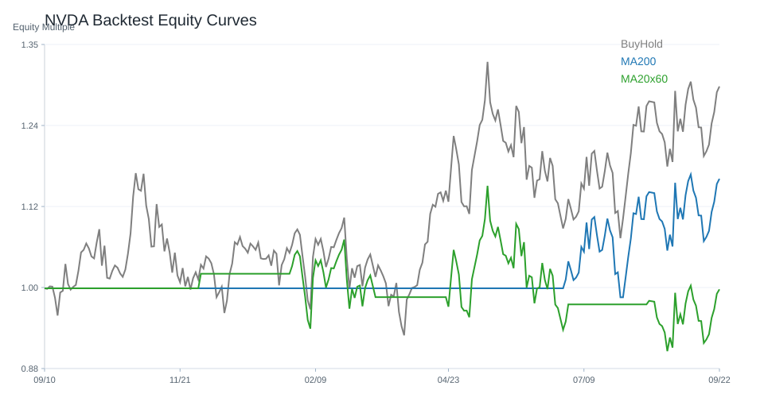

---

# 十、個股研究訊號與觀察等級

研究訊號僅供分析，不是買賣建議。
## 台股
觀察等級較高：
- 富邦金(2881)：積極觀察；研究訊號 強烈偏多，分數 10。多項量化與事件條件同時偏正向，適合列為優先研究名單。依據：20 日漲幅偏強、60 日趨勢偏強、站上 20 日均線、站上 200 日均線。
- 國泰金(2882)：積極觀察；研究訊號 強烈偏多，分數 10。多項量化與事件條件同時偏正向，適合列為優先研究名單。依據：20 日漲幅偏強、60 日趨勢偏強、站上 20 日均線、站上 200 日均線。
- 台積電(2330)：積極觀察；研究訊號 強烈偏多，分數 9。多項量化與事件條件同時偏正向，適合列為優先研究名單。依據：20 日漲幅偏強、站上 20 日均線、站上 200 日均線、RSI 位於中性偏強區。
- 華碩(2357)：積極觀察；研究訊號 強烈偏多，分數 8。多項量化與事件條件同時偏正向，適合列為優先研究名單。依據：20 日漲幅偏強、60 日趨勢偏強、站上 20 日均線、站上 200 日均線。
- 主動統一台股增長(00981A)：積極觀察；研究訊號 強烈偏多，分數 6。多項量化與事件條件同時偏正向，適合列為優先研究名單。依據：站上 20 日均線、站上 200 日均線、RSI 位於中性偏強區、MACD histogram 為正。
降低關注 / 風險觀察：
- 鴻海(2317)：降低關注；研究訊號 偏空，分數 -4。部分條件偏弱，研究關注度應低於正向標的。依據：60 日趨勢偏弱、跌破 20 日均線、站上 200 日均線、MACD histogram 為負。
- 緯創(3231)：維持觀察；研究訊號 中性，分數 -2。正負條件尚未形成明確方向，維持一般追蹤。依據：跌破 20 日均線、站上 200 日均線、RSI 位於中性偏強區、MACD histogram 為負。
- 富邦科技(0052)：維持觀察；研究訊號 中性，分數 -1。正負條件尚未形成明確方向，維持一般追蹤。依據：站上 20 日均線、跌破 200 日均線、RSI 位於中性偏強區、MACD histogram 為正。
- 技嘉(2376)：維持觀察；研究訊號 中性，分數 -1。正負條件尚未形成明確方向，維持一般追蹤。依據：20 日漲幅偏強、60 日趨勢偏弱、跌破 20 日均線、站上 200 日均線。
- 聯發科(2454)：維持觀察；研究訊號 中性，分數 0。正負條件尚未形成明確方向，維持一般追蹤。依據：20 日漲幅偏強、60 日趨勢偏弱、跌破 20 日均線、站上 200 日均線。
## 美股
觀察等級較高：
- MU：正向觀察；研究訊號 偏多，分數 5。部分條件偏正向，可持續追蹤後續資料是否延續。依據：20 日漲幅偏強、站上 20 日均線、站上 200 日均線、RSI 位於中性偏強區。
- CRM：正向觀察；研究訊號 偏多，分數 4。部分條件偏正向，可持續追蹤後續資料是否延續。依據：20 日漲幅偏強、站上 20 日均線、站上 200 日均線、RSI 位於中性偏強區。
- MSFT：正向觀察；研究訊號 偏多，分數 4。部分條件偏正向，可持續追蹤後續資料是否延續。依據：20 日漲幅偏強、站上 20 日均線、站上 200 日均線、MACD histogram 為負。
- NFLX：正向觀察；研究訊號 偏多，分數 4。部分條件偏正向，可持續追蹤後續資料是否延續。依據：20 日漲幅偏強、站上 20 日均線、跌破 200 日均線、MACD histogram 為正。
- TSM：正向觀察；研究訊號 偏多，分數 4。部分條件偏正向，可持續追蹤後續資料是否延續。依據：20 日漲幅偏強、站上 20 日均線、站上 200 日均線、RSI 位於中性偏強區。
降低關注 / 風險觀察：
- AVGO：高風險觀察；研究訊號 強烈偏空，分數 -7。多項條件偏弱或風險較高，研究上需提高風險意識。依據：20 日跌幅偏弱、60 日趨勢偏弱、跌破 20 日均線、跌破 200 日均線。
- INTC：降低關注；研究訊號 偏空，分數 -4。部分條件偏弱，研究關注度應低於正向標的。依據：60 日趨勢偏弱、跌破 20 日均線、站上 200 日均線、MACD histogram 為負。
- META：降低關注；研究訊號 偏空，分數 -3。部分條件偏弱，研究關注度應低於正向標的。依據：跌破 20 日均線、跌破 200 日均線、RSI 位於中性偏強區、MACD histogram 為負。
- AAPL：維持觀察；研究訊號 中性，分數 -2。正負條件尚未形成明確方向，維持一般追蹤。依據：20 日跌幅偏弱、跌破 20 日均線、站上 200 日均線、RSI 位於中性偏強區。
- AMD：維持觀察；研究訊號 中性，分數 -1。正負條件尚未形成明確方向，維持一般追蹤。依據：20 日漲幅偏強、跌破 20 日均線、站上 200 日均線、RSI 位於中性偏強區。

---

# 十一、結論

目前市場偏向：偏多。

原因：綜合評分 5；QQQ 20 日漲跌與 200 日均線偏多；0050 20 日漲跌與 200 日均線偏多；QQQ 事件新聞偏多；新聞主題偏向 AI、半導體或企業成長；總經風險中等。

不得提供投資建議。

所有分析僅供研究用途。

---

## 系統狀態

- 回測狀態：已取得資料
- 研究用途：research_only
- 投資建議：否

## 回測摘要

回測假設：交易成本 0.10%；策略使用前一交易日訊號承擔下一交易日報酬，避免偷看未來資料。
回測僅為歷史資料研究，不代表未來績效，也不是投資建議。
策略說明：
- price_above_ma200：收盤價高於 200 日均線時持有，否則空手。
- ma20_cross_ma60：20 日均線高於 60 日均線時持有，否則空手。
- buy_and_hold：買入持有基準，用於比較策略是否優於單純持有。
台股回測標的數：23
- 200 日均線策略 Sharpe 前五：元大台灣50(0050)(Sharpe 1.72, CAGR 38.94%, MDD -21.30%, 交易 3 次, 均持有 246.0 日)、奇鋐(3017)(Sharpe 1.60, CAGR 96.60%, MDD -42.26%, 交易 7 次, 均持有 100.43 日)、元大高股息(0056)(Sharpe 1.55, CAGR 23.96%, MDD -17.70%, 交易 9 次, 均持有 75.67 日)、台積電(2330)(Sharpe 1.54, CAGR 44.97%, MDD -24.54%, 交易 9 次, 均持有 81.78 日)、中信金(2891)(Sharpe 1.48, CAGR 32.95%, MDD -17.86%, 交易 4 次, 均持有 197.25 日)
- 20/60 均線策略 Sharpe 前五：主動統一台股增長(00981A)(Sharpe 2.33, CAGR 99.77%, MDD -19.71%, 交易 1 次, 均持有 231.0 日)、台達電(2308)(Sharpe 1.62, CAGR 63.20%, MDD -27.80%, 交易 9 次, 均持有 69.22 日)、元大台灣50(0050)(Sharpe 1.59, CAGR 35.04%, MDD -21.30%, 交易 5 次, 均持有 144.8 日)、奇鋐(3017)(Sharpe 1.54, CAGR 82.39%, MDD -30.69%, 交易 9 次, 均持有 72.33 日)、台積電(2330)(Sharpe 1.51, CAGR 44.11%, MDD -24.54%, 交易 5 次, 均持有 145.8 日)
美股回測標的數：20
- 200 日均線策略 Sharpe 前五：MU(Sharpe 1.41, CAGR 75.86%, MDD -56.04%, 交易 11 次, 均持有 56.82 日)、VOO(Sharpe 1.19, CAGR 12.80%, MDD -10.35%, 交易 5 次, 均持有 148.4 日)、TSM(Sharpe 1.08, CAGR 34.73%, MDD -23.30%, 交易 8 次, 均持有 89.0 日)、NVDA(Sharpe 1.07, CAGR 39.43%, MDD -29.35%, 交易 6 次, 均持有 122.0 日)、VT(Sharpe 1.04, CAGR 11.47%, MDD -11.31%, 交易 8 次, 均持有 94.62 日)
- 20/60 均線策略 Sharpe 前五：NVDA(Sharpe 1.44, CAGR 61.96%, MDD -27.12%, 交易 8 次, 均持有 83.88 日)、MU(Sharpe 1.36, CAGR 71.60%, MDD -39.10%, 交易 10 次, 均持有 68.5 日)、META(Sharpe 1.16, CAGR 36.56%, MDD -36.55%, 交易 9 次, 均持有 72.56 日)、TSM(Sharpe 1.10, CAGR 35.20%, MDD -22.56%, 交易 8 次, 均持有 88.5 日)、AAPL(Sharpe 1.00, CAGR 17.30%, MDD -15.23%, 交易 8 次, 均持有 72.75 日)
