# 每日市場研究報告

日期：2026-10-01

> 本報告僅供研究用途，不構成任何投資建議。

---

# 一、市場概況

今日全球市場重點：

- 台股：已取得資料
- 美股：已取得資料

市場摘要：已收集 88 個市場資料檔案。

- 台股：已統計 23 個標的；20 日相對強勢：聯發科(2454)(25.35%)、日月光投控(3711)(20.38%)、聯電(2303)(19.77%)、欣興(3037)(17.62%)、南電(8046)(8.94%)
- 美股：已統計 20 個標的；20 日相對強勢：INTC(29.52%)、META(29.08%)、AMD(29.07%)、MU(11.09%)、SOXX(11.04%)

---

# 二、台股分析

## 大盤

台股觀察清單，以下列出前 12 個標的：
- 元大台灣50(0050)：收盤 111.30；20 日 4.07%；60 日 2.72%；200 日均線之上：是
- 富邦科技(0052)：收盤 64.95；20 日 4.17%；60 日 2.20%；200 日均線之上：是
- 元大高股息(0056)：收盤 56.55；20 日 5.01%；60 日 7.00%；200 日均線之上：是
- 主動統一台股增長(00981A)：收盤 30.31；20 日 0.73%；60 日 -6.04%；200 日均線之上：是
- 聯電(2303)：收盤 154.50；20 日 19.77%；60 日 -6.93%；200 日均線之上：是
- 台達電(2308)：收盤 1890.00；20 日 2.72%；60 日 -5.26%；200 日均線之上：是
- 鴻海(2317)：收盤 251.50；20 日 0.60%；60 日 3.93%；200 日均線之上：是
- 台積電(2330)：收盤 2480.00；20 日 3.12%；60 日 0.81%；200 日均線之上：是
- 華碩(2357)：收盤 961.00；20 日 -3.80%；60 日 41.32%；200 日均線之上：是
- 技嘉(2376)：收盤 358.50；20 日 0.14%；60 日 6.54%；200 日均線之上：是
- 廣達(2382)：收盤 333.50；20 日 -1.48%；60 日 -11.77%；200 日均線之上：是
- 中華電(2412)：收盤 143.50；20 日 5.51%；60 日 1.41%；200 日均線之上：是
- 其餘 11 個標的已納入統計與強弱排行。

## 成交量

量價分析標的數：23
- 量價偏多觀察：聯電(2303)(量縮整理, 分數 2, 5 日 -1.59%, 量比 0.56x)、聯發科(2454)(量能中性, 分數 2, 5 日 -1.80%, 量比 0.93x)、日月光投控(3711)(量能中性, 分數 2, 5 日 6.03%, 量比 0.86x)、富邦科技(0052)(量能中性, 分數 1, 5 日 1.80%, 量比 0.94x)、元大高股息(0056)(放量震盪, 分數 1, 5 日 -0.53%, 量比 1.45x)
- 量價偏弱觀察：世芯-KY(3661)(量能中性, 分數 -2, 5 日 2.05%, 量比 0.46x)、緯穎(6669)(量能中性, 分數 -2, 5 日 -2.79%, 量比 0.43x)、主動統一台股增長(00981A)(價漲量縮, 分數 -1, 5 日 4.27%, 量比 0.70x)、國泰金(2882)(量能中性, 分數 -1, 5 日 -1.77%, 量比 1.01x)

## 類股輪動

MVP 尚未接入完整類股分類資料，暫不推論類股輪動。

## 強勢股

聯發科(2454)(25.35%)、日月光投控(3711)(20.38%)、聯電(2303)(19.77%)、欣興(3037)(17.62%)、南電(8046)(8.94%)

## 弱勢股

緯穎(6669)(-12.13%)、世芯-KY(3661)(-8.22%)、華碩(2357)(-3.80%)、廣達(2382)(-1.48%)、技嘉(2376)(0.14%)

---

# 三、美股分析

## 主要 ETF

- QQQ：收盤 737.93；20 日 2.95%；60 日 2.09%；200 日均線之上：是
- VOO：收盤 702.46；20 日 -0.34%；60 日 1.71%；200 日均線之上：是
- VT：收盤 158.45；20 日 -1.31%；60 日 0.41%；200 日均線之上：是
- SOXX：收盤 567.44；20 日 11.04%；60 日 -2.42%；200 日均線之上：是

## 科技股

- NVDA：收盤 227.21；20 日 2.91%；60 日 16.19%；200 日均線之上：是
- AAPL：收盤 329.40；20 日 3.96%；60 日 5.35%；200 日均線之上：是
- MSFT：收盤 508.96；20 日 0.33%；60 日 31.60%；200 日均線之上：是
- TSM：收盤 456.94；20 日 10.02%；60 日 1.14%；200 日均線之上：是

## 半導體

- SOXX：收盤 567.44；20 日 11.04%；60 日 -2.42%；200 日均線之上：是
- NVDA：收盤 227.21；20 日 2.91%；60 日 16.19%；200 日均線之上：是
- TSM：收盤 456.94；20 日 10.02%；60 日 1.14%；200 日均線之上：是

## AI 概念股

目前以 NVDA、MSFT、TSM 作為 AI 相關觀察清單，不擴大推論到未納入資料的標的。

---

# 四、技術分析

技術分析狀態：已取得資料

AI 不重新計算 RSI、MACD、EMA、KD、ATR、ADX，只解讀 Python 輸出的結果。

Python 已提供價格趨勢統計，包括 1 日、5 日、20 日、60 日、252 日漲跌幅，以及 20/60/200 日均線位置與 52 週高低點距離。

Python 也已計算 RSI(14)、MACD(12/26/9)、EMA(20/50/200)、KD(9)、Bollinger Bands(20, 2)、ATR(14)、ADX(14)。

- 元大台灣50(0050)：RSI14 61.41；MACD hist 0.28；K/D 74.07/70.23；ADX 16.58；布林上/中/下 113.08/108.95/104.81
- 台積電(2330)：RSI14 57.55；MACD hist 4.68；K/D 74.02/67.40；ADX 18.89；布林上/中/下 2516.24/2439.00/2361.76
- QQQ：RSI14 59.21；MACD hist 2.16；K/D 78.65/79.80；ADX 13.32；布林上/中/下 751.85/722.94/694.03
- VOO：RSI14 48.71；MACD hist -0.03；K/D 55.31/64.39；ADX 10.78；布林上/中/下 714.50/703.76/693.01
- SOXX：RSI14 60.64；MACD hist 5.69；K/D 86.70/84.32；ADX 16.78；布林上/中/下 587.03/532.20/477.37
- NVDA：RSI14 56.59；MACD hist 0.50；K/D 70.95/69.62；ADX 14.07；布林上/中/下 233.99/222.64/211.30

## 量價分析

Python 已依成交量與價格變化產生量價型態，AI 只解讀輸出結果。

- 元大台灣50(0050)：放量震盪；5 日 1.32%；20 日 4.07%；量比 20 日均量 1.42 倍；OBV 20 日量壓 1.45%；說明：量能放大但價格方向尚未明確
- 台積電(2330)：放量震盪；5 日 0.00%；20 日 3.12%；量比 20 日均量 1.58 倍；OBV 20 日量壓 21.33%；說明：量能放大但價格方向尚未明確、OBV 20 日量壓偏正向
- QQQ：量能中性；5 日 -1.27%；20 日 2.95%；量比 20 日均量 0.81 倍；OBV 20 日量壓 13.60%；說明：量價未出現明確偏多或偏空結構、OBV 20 日量壓偏正向
- VOO：量能中性；5 日 -1.45%；20 日 -0.34%；量比 20 日均量 0.80 倍；OBV 20 日量壓 -30.37%；說明：量價未出現明確偏多或偏空結構、OBV 20 日量壓偏負向
- SOXX：量縮整理；5 日 -0.93%；20 日 11.04%；量比 20 日均量 0.72 倍；OBV 20 日量壓 39.14%；說明：價格震盪不大且成交量偏低、20 日價格趨勢偏強
- NVDA：量能中性；5 日 -0.73%；20 日 2.91%；量比 20 日均量 0.90 倍；OBV 20 日量壓 18.83%；說明：量價未出現明確偏多或偏空結構、OBV 20 日量壓偏正向

---

# 五、新聞分析

新聞分析狀態：已取得資料

最近 30 天 RSS 收集結果：財經新聞 89 則，科技新聞 30 則，台灣財經新聞 199 則。

新聞摘要：最近新聞共 318 則；主要分類分布為 ai_semiconductor:239、other:55、macro_rates:29；高頻關鍵字包含 AI、台積電、台股、半導體、Trump、Meta、外資、Fed。

分類統計：AI / 半導體:239、總經 / 利率:29、財報 / 企業:18、市場風險:21、其他:55

高頻關鍵字：AI(246)、台積電(61)、台股(25)、半導體(16)、Trump(13)、Meta(10)、外資(7)、Fed(6)、目標價(6)、通膨(4)

代表新聞：

- [CNBC Finance] OpenAI flags Chinese-linked effort to extract AI model reasoning (Thu, 01 Oct 2026 01:06:02 GMT)
- [Google News 台股半導體] 00830現在還能投資嗎？AI、半導體漲一大段 新手怕「剛好買在高點」 - UDN (Thu, 01 Oct 2026 00:45:17 GMT)
- [MarketWatch Top Stories] ‘I’m never selling’: I’m 47 and buy bitcoin with every dollar I earn. Am I crazy? (Thu, 01 Oct 2026 00:45:00 GMT)
- [CNBC Finance] Inside India newsletter: Foreign insurers get the red-carpet treatment — and policy uncertainty (Thu, 01 Oct 2026 00:23:44 GMT)
- [MarketWatch Top Stories] ‘I have $400,000 in equity’: I’m 80. Should I sell my house because of dangerous stairs — or spend thousands renovating? (Thu, 01 Oct 2026 00:20:00 GMT)
- [Google News 台股半導體] Island募資4億美元，從企業瀏覽器擴展AI代理治理 - iThome (Thu, 01 Oct 2026 00:11:25 GMT)
- [MarketWatch Top Stories] I’m 71 and still working. I earn $108,000 a year. Am I doing the right thing? (Thu, 01 Oct 2026 00:11:00 GMT)
- [CNBC Finance] California Gov. Gavin Newsom bans AI 'robo bosses' in landmark state law, reversing his earlier veto (Wed, 30 Sep 2026 23:50:01 GMT)

分析：

- 市場影響：可依新聞分類與高頻關鍵字判斷市場關注焦點。
- 利多：若 AI / 半導體、企業財報與展望新聞占比提高，偏向成長題材支撐。
- 利空：若總經利率、波動、地緣政治與衰退新聞占比提高，需提高風險意識。

## 事件影響

依新聞標題與摘要的標的別名、產業主題與事件關鍵字進行規則式匹配。
### 台股
- 事件支撐觀察：元大台灣50(0050)(事件偏多, 分數 2, 新聞 27 則)、富邦科技(0052)(事件偏多, 分數 2, 新聞 28 則)、元大高股息(0056)(事件偏多, 分數 2, 新聞 27 則)、主動統一台股增長(00981A)(事件偏多, 分數 2, 新聞 27 則)、聯發科(2454)(事件偏多, 分數 2, 新聞 30 則)
- 事件風險觀察：資料不足
- 元大台灣50(0050)：事件偏多，分數 2，匹配新聞 27 則，主題 台股 / ETF:27、AI / 半導體:15；代表新聞：[台股第4季買什麼？台積電、富邦金...杜金龍公開4檔口袋名單「一路抱到明年5月」：台塑四寶「這檔」暴賺170% - 今周刊](https://news.google.com/rss/articles/CBMigAFBVV95cUxNcUk5SlJua1A5R3NncUwwSEJQNGdSdjBIdzBxWWxFZm9jUjlFSWh1VFhIWUdtX0FmZkNnWFY0cUg2X0oxanNOYWVsYUFoN2RwMno3SXVnVmVQQXRBVHpGamNZc0l2Y1oyeHk5alZqXzFSNjFpUTNvX2k4TmU1S0dYRA?oc=5)
- 富邦科技(0052)：事件偏多，分數 2，匹配新聞 28 則，主題 台股 / ETF:27、AI / 半導體:16；代表新聞：[台股第4季買什麼？台積電、富邦金...杜金龍公開4檔口袋名單「一路抱到明年5月」：台塑四寶「這檔」暴賺170% - 今周刊](https://news.google.com/rss/articles/CBMigAFBVV95cUxNcUk5SlJua1A5R3NncUwwSEJQNGdSdjBIdzBxWWxFZm9jUjlFSWh1VFhIWUdtX0FmZkNnWFY0cUg2X0oxanNOYWVsYUFoN2RwMno3SXVnVmVQQXRBVHpGamNZc0l2Y1oyeHk5alZqXzFSNjFpUTNvX2k4TmU1S0dYRA?oc=5)
- 元大高股息(0056)：事件偏多，分數 2，匹配新聞 27 則，主題 台股 / ETF:27、AI / 半導體:15；代表新聞：[台股第4季買什麼？台積電、富邦金...杜金龍公開4檔口袋名單「一路抱到明年5月」：台塑四寶「這檔」暴賺170% - 今周刊](https://news.google.com/rss/articles/CBMigAFBVV95cUxNcUk5SlJua1A5R3NncUwwSEJQNGdSdjBIdzBxWWxFZm9jUjlFSWh1VFhIWUdtX0FmZkNnWFY0cUg2X0oxanNOYWVsYUFoN2RwMno3SXVnVmVQQXRBVHpGamNZc0l2Y1oyeHk5alZqXzFSNjFpUTNvX2k4TmU1S0dYRA?oc=5)
- 主動統一台股增長(00981A)：事件偏多，分數 2，匹配新聞 27 則，主題 台股 / ETF:27、AI / 半導體:15；代表新聞：[台股第4季買什麼？台積電、富邦金...杜金龍公開4檔口袋名單「一路抱到明年5月」：台塑四寶「這檔」暴賺170% - 今周刊](https://news.google.com/rss/articles/CBMigAFBVV95cUxNcUk5SlJua1A5R3NncUwwSEJQNGdSdjBIdzBxWWxFZm9jUjlFSWh1VFhIWUdtX0FmZkNnWFY0cUg2X0oxanNOYWVsYUFoN2RwMno3SXVnVmVQQXRBVHpGamNZc0l2Y1oyeHk5alZqXzFSNjFpUTNvX2k4TmU1S0dYRA?oc=5)
- 聯發科(2454)：事件偏多，分數 2，匹配新聞 30 則，主題 AI / 半導體:10、財報 / 企業:5；代表新聞：[昨天抄底今帳上秒增值19萬元！聯發科強彈逾3％ 重返5000元大關 - Yahoo股市](https://news.google.com/rss/articles/CBMikgNBVV95cUxPQnVlNnhrcXJVblVjYzBPU1AyTHk1RlZ6ZXY0MWZDOFE0RFRPTkN3VFFETmoyUy1jRGRCUTRiN1loT3dDZWM4ZEtNNkFONU1IMTJzamcxSVZjeWc0RXQ5MnpPNTd3R19IdFUzY3lMSTFXRlJwZFdFM2tyQmZ4X1Npck5DUU5vQUpxZjhETXJTZnp0WV9tbGpuVFB3UndJZ1lYZHdyaEF5RldjQXZ2QV94STVDcEo1djJ6SF9LdURLd3VsWU9tSmpvazdIQ1RIelJaRVZvbmxQZkhEWHZFWV9WQ1llQTBNbnR1N0VpYmtnWmVwZEo1ZUFVc0lYWW5jbkJIQ3dQemdGRng2X0FmclpNbHNZRmdCeG9ac3ItcjB0RVF3eEdnX1lRZG9CbUVYcU1PUUcycW5FMHpweDR4ZEwzTXNEaHRUWkQwUXdySjQzdnpjRFNYeXc4X2RvQ2VIM2k3VWk1dkFTVldHWHFVZllRQmYtR1l2Zlh2QnhGay16RlpCOXlRS3Jzdk5wNnF5Y3NJN2c?oc=5)
### 美股
- 事件支撐觀察：SOXX(事件偏多, 分數 5, 新聞 94 則)
- 事件風險觀察：META(事件偏空, 分數 -2, 新聞 6 則)
- SOXX：事件偏多，分數 5，匹配新聞 94 則，主題 AI / 半導體:94、財報 / 企業:3；代表新聞：[Micron beats on earnings and issues strong guidance as data center revenue jumps 11-fold](https://www.cnbc.com/2026/09/30/micron-mu-q4-earnings-report-2026.html)
- META：事件偏空，分數 -2，匹配新聞 6 則，主題 AI / 半導體:5；代表新聞：[OpenAI、Anthropic、微軟、Meta 研究領袖罕見聯手示警：AI 研究自動化恐引發「智慧爆炸」 - TechNews 科技新報](https://news.google.com/rss/articles/CBMipAFBVV95cUxNNThBczNfSHI4WDVKNFdvRmVpWnhwUTBIa0t6SDlFaWJ6aVh3N09SZ1l2QjlJSzZQbFFJdEw1MlNzLThjaDJhbUJEd0txdEZiOG1tN0xyOVZrdGtjUEhzOG8yQ0NwOHVQaExpTEtsdk5jbE1YLXV3TWJsNFZhRFdURE1RZFJndXBicThkTTlSZi1VTktlREhid3pBeHJCNEtDU1BuaA?oc=5)

---

# 六、總經分析

總經分析狀態：已取得資料

包含：

- CPI
- 利率
- PMI
- GDP
- VIX
- 美元指數
- 公債殖利率

總經摘要：Fed Funds Rate 3.63，近 3 期趨勢 持平；美國 10 年期公債殖利率 5.293，近 3 期趨勢 連續上升；VIX 16.34，近 3 期趨勢 最近一期上升。整體總經風險分級：high。
- CPI：334.13（2026-08-01）；前期變化 +1.32 / 0.40%；近 3 期趨勢 連續上升；風險 中等
- Fed Funds Rate：3.63（2026-08-01）；前期變化 0.00 / 0.00%；近 3 期趨勢 持平；風險 偏低
- GDP：32563.03（2026-04-01）；前期變化 +656.76 / 2.06%；近 3 期趨勢 連續上升；風險 中等
- 美元指數：120.33（2026-09-25）；前期變化 -0.22 / -0.18%；近 3 期趨勢 最近一期下降；風險 中等
- PMI：PMI 尚未接入可靠公開資料來源。
- VIX：16.34（2026-09-30）；前期變化 +0.30 / 1.87%；近 3 期趨勢 最近一期上升；風險 偏低
- 美國 10 年期公債殖利率：5.29（2026-09-30）；前期變化 +0.04 / 0.72%；近 3 期趨勢 連續上升；風險 偏高
整體總經風險分級：偏高

---

# 七、風險分析

目前主要風險：

- 市場風險：依 VIX、均線與短中期漲跌幅觀察
- 總經風險：依利率、美元指數與公債殖利率觀察
- 政策風險：資料來源尚未接入政策事件資料
- 地緣政治：資料來源尚未接入地緣政治事件資料

風險摘要：總經風險分級：偏高。

總經風險總評：偏高
- Fed Funds Rate：偏低；趨勢 持平；最新值 3.63
- 美元指數：中等；趨勢 最近一期下降；最新值 120.33
- VIX：偏低；趨勢 最近一期上升；最新值 16.34
- 美國 10 年期公債殖利率：偏高；趨勢 連續上升；最新值 5.29

---

# 八、未來觀察重點

接下來應持續關注：

- 財報
- 經濟數據
- Fed
- 國際事件

---

# 九、圖表摘要

以下圖表由 Python 自動產生，包含價格均線、量價關係與回測權益曲線。

## 元大台灣50(0050)

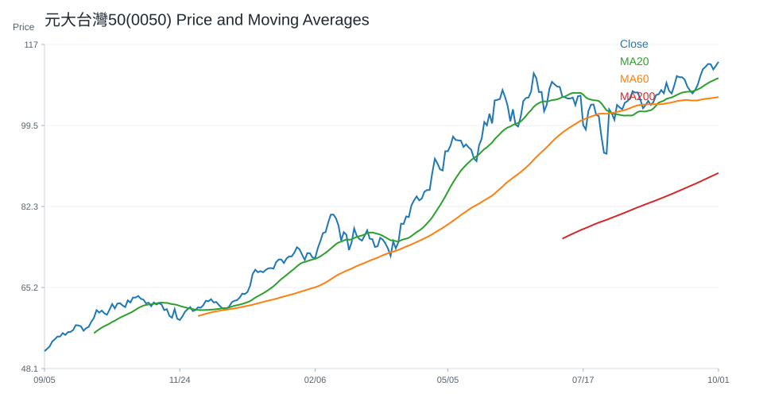

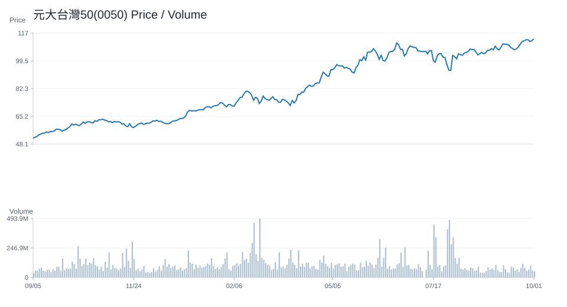

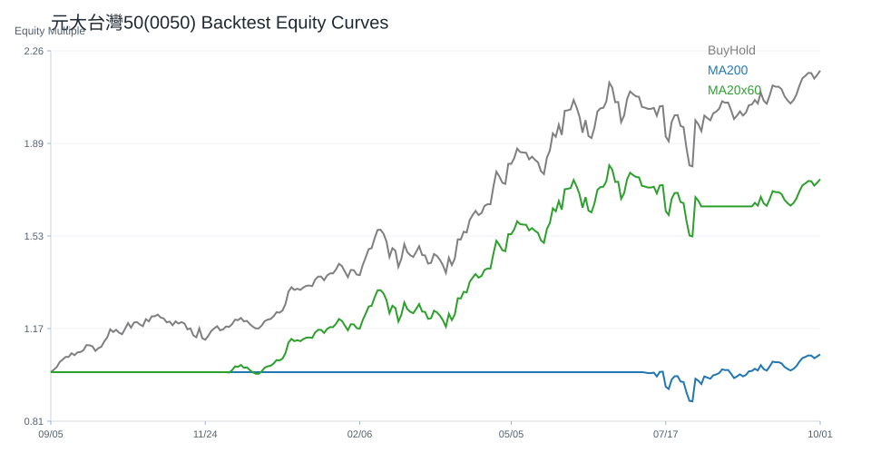

## 台積電(2330)

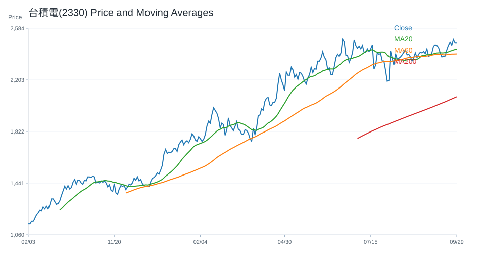

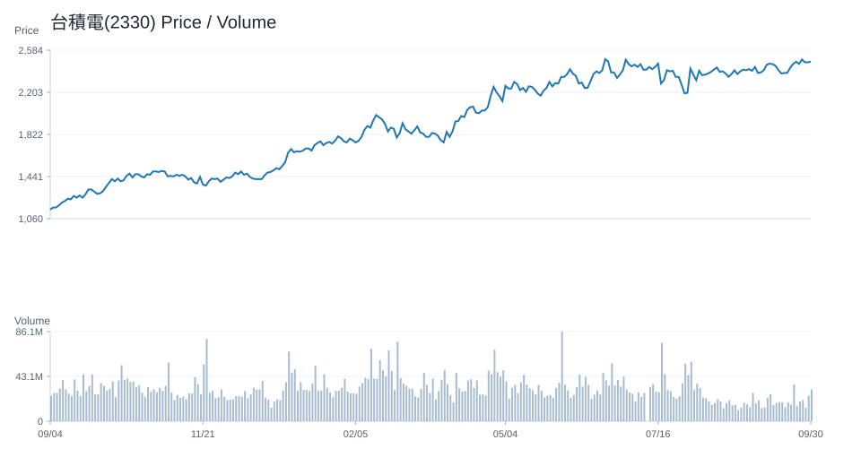

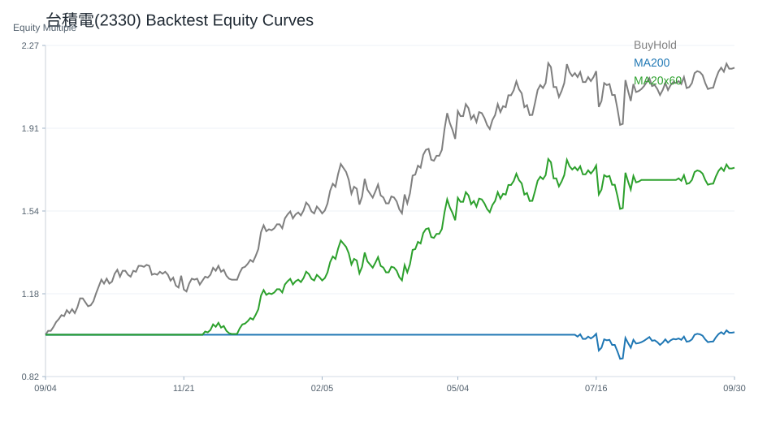

## QQQ

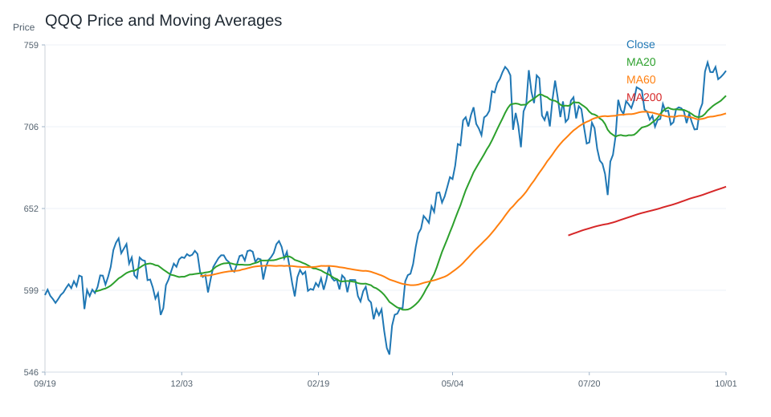

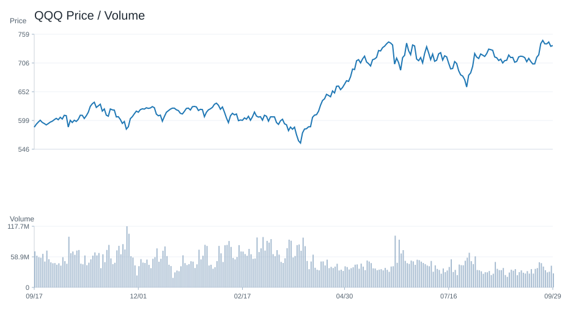

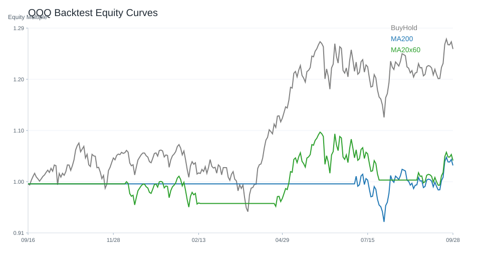

## VOO

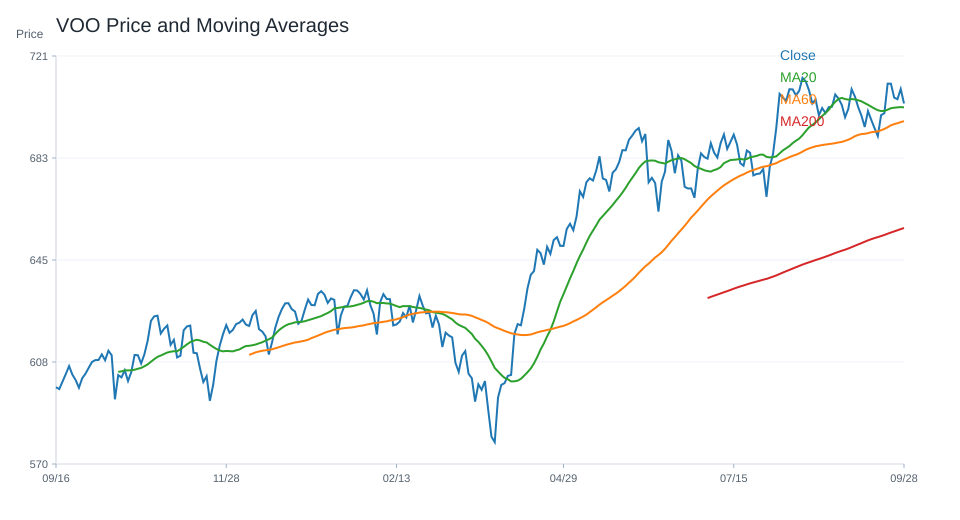

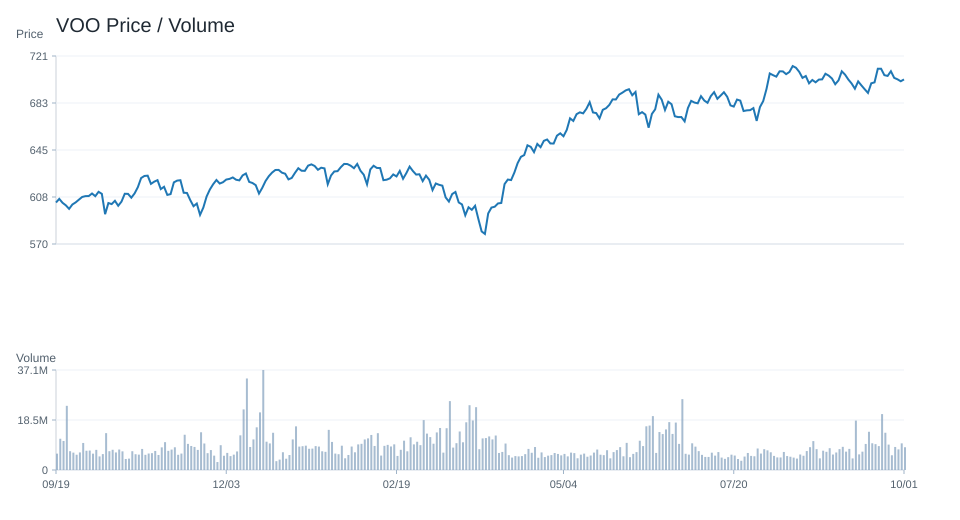

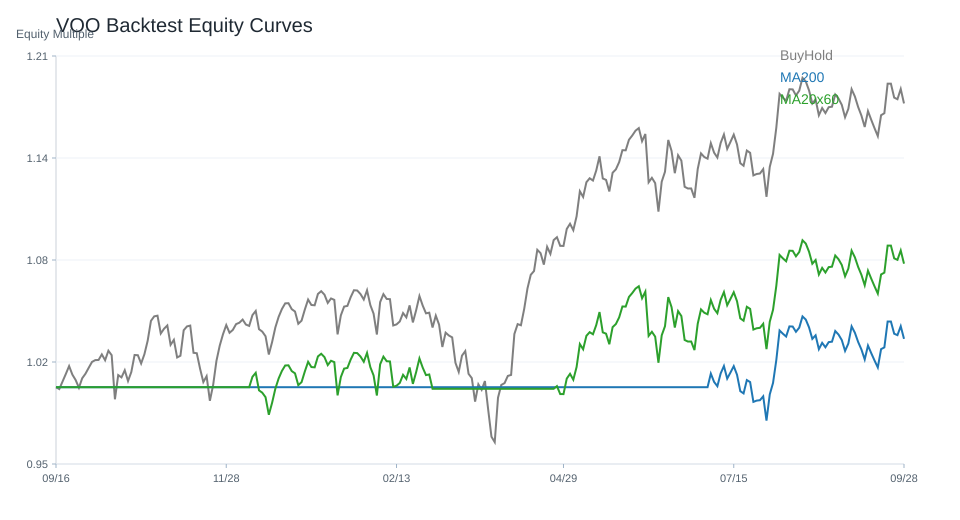

## SOXX

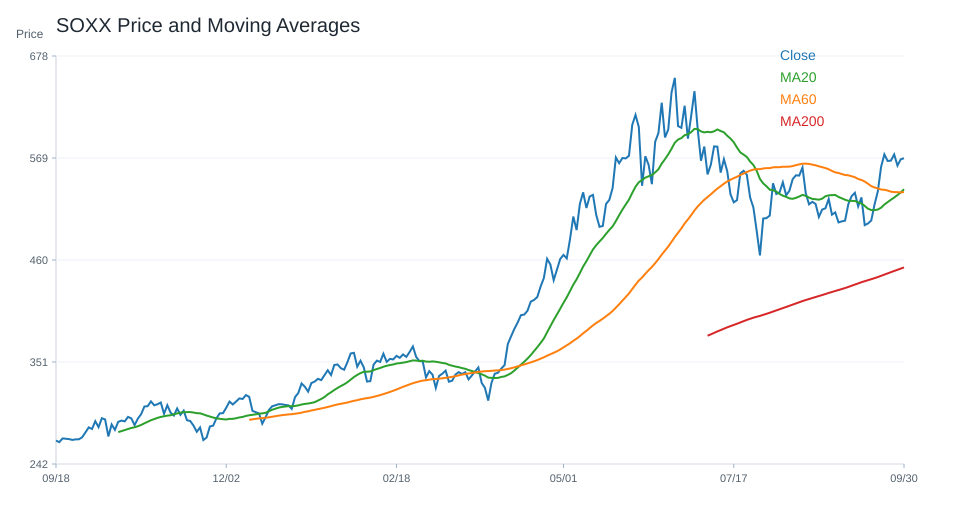

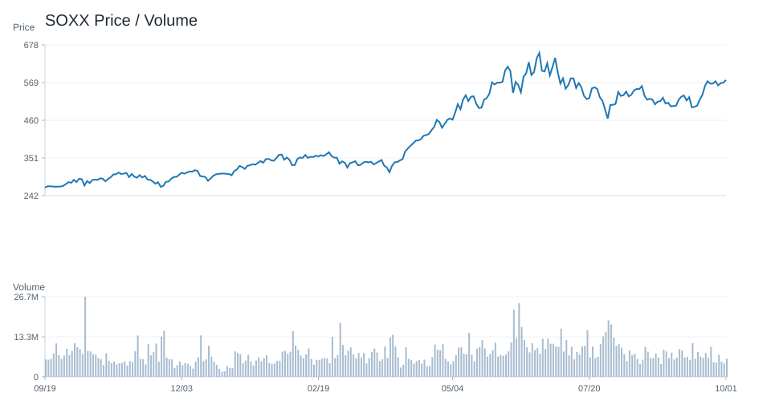

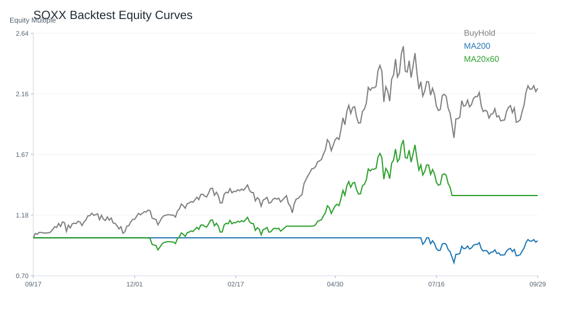

## NVDA

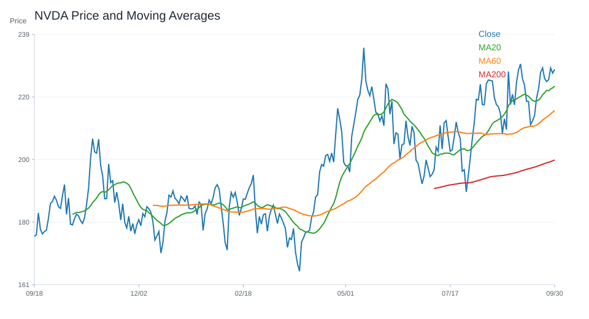

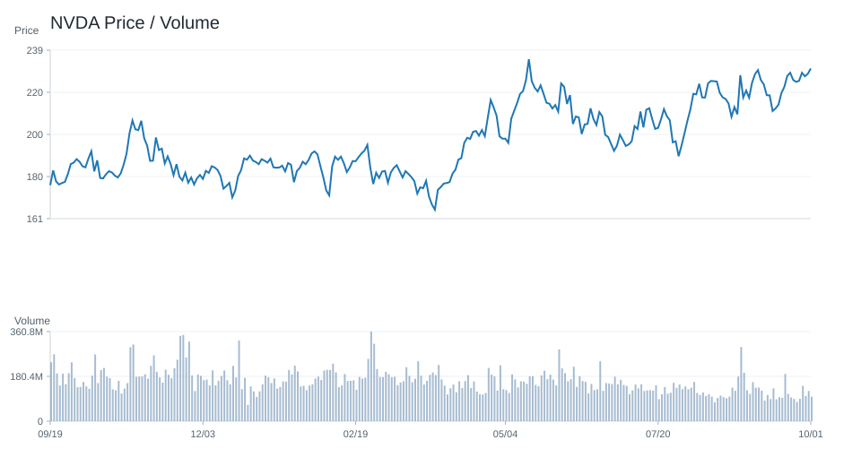

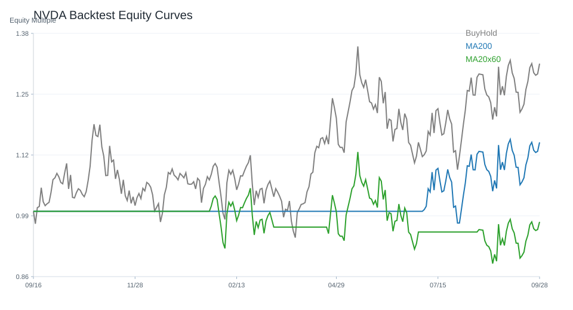

---

# 十、個股研究訊號與觀察等級

研究訊號僅供分析，不是買賣建議。
## 台股
觀察等級較高：
- 聯發科(2454)：積極觀察；研究訊號 強烈偏多，分數 8。多項量化與事件條件同時偏正向，適合列為優先研究名單。依據：20 日漲幅偏強、60 日趨勢偏強、站上 20 日均線、站上 200 日均線。
- 元大台灣50(0050)：積極觀察；研究訊號 強烈偏多，分數 6。多項量化與事件條件同時偏正向，適合列為優先研究名單。依據：站上 20 日均線、站上 200 日均線、RSI 位於中性偏強區、MACD histogram 為正。
- 台積電(2330)：積極觀察；研究訊號 強烈偏多，分數 6。多項量化與事件條件同時偏正向，適合列為優先研究名單。依據：站上 20 日均線、站上 200 日均線、RSI 位於中性偏強區、MACD histogram 為正。
- 主動統一台股增長(00981A)：正向觀察；研究訊號 偏多，分數 5。部分條件偏正向，可持續追蹤後續資料是否延續。依據：站上 20 日均線、站上 200 日均線、RSI 位於中性偏強區、MACD histogram 為正。
- 台達電(2308)：正向觀察；研究訊號 偏多，分數 5。部分條件偏正向，可持續追蹤後續資料是否延續。依據：站上 20 日均線、站上 200 日均線、RSI 位於中性偏強區、MACD histogram 為正。
降低關注 / 風險觀察：
- 廣達(2382)：降低關注；研究訊號 偏空，分數 -5。部分條件偏弱，研究關注度應低於正向標的。依據：60 日趨勢偏弱、跌破 20 日均線、站上 200 日均線、RSI 位於中性偏強區。
- 緯穎(6669)：降低關注；研究訊號 偏空，分數 -5。部分條件偏弱，研究關注度應低於正向標的。依據：20 日跌幅偏弱、60 日趨勢偏強、跌破 20 日均線、站上 200 日均線。
- 世芯-KY(3661)：降低關注；研究訊號 偏空，分數 -4。部分條件偏弱，研究關注度應低於正向標的。依據：20 日跌幅偏弱、60 日趨勢偏弱、跌破 20 日均線、站上 200 日均線。
- 國泰金(2882)：維持觀察；研究訊號 中性，分數 -1。正負條件尚未形成明確方向，維持一般追蹤。依據：60 日趨勢偏強、跌破 20 日均線、站上 200 日均線、RSI 位於中性偏強區。
- 緯創(3231)：維持觀察；研究訊號 中性，分數 0。正負條件尚未形成明確方向，維持一般追蹤。依據：60 日趨勢偏強、跌破 20 日均線、站上 200 日均線、RSI 位於中性偏強區。
## 美股
觀察等級較高：
- MU：積極觀察；研究訊號 強烈偏多，分數 7。多項量化與事件條件同時偏正向，適合列為優先研究名單。依據：20 日漲幅偏強、站上 20 日均線、站上 200 日均線、RSI 位於中性偏強區。
- NVDA：積極觀察；研究訊號 強烈偏多，分數 7。多項量化與事件條件同時偏正向，適合列為優先研究名單。依據：60 日趨勢偏強、站上 20 日均線、站上 200 日均線、RSI 位於中性偏強區。
- SOXX：積極觀察；研究訊號 強烈偏多，分數 6。多項量化與事件條件同時偏正向，適合列為優先研究名單。依據：20 日漲幅偏強、站上 20 日均線、站上 200 日均線、RSI 位於中性偏強區。
- TSM：積極觀察；研究訊號 強烈偏多，分數 6。多項量化與事件條件同時偏正向，適合列為優先研究名單。依據：20 日漲幅偏強、站上 20 日均線、站上 200 日均線、MACD histogram 為正。
- AMD：正向觀察；研究訊號 偏多，分數 5。部分條件偏正向，可持續追蹤後續資料是否延續。依據：20 日漲幅偏強、60 日趨勢偏強、站上 20 日均線、站上 200 日均線。
降低關注 / 風險觀察：
- ORCL：高風險觀察；研究訊號 強烈偏空，分數 -9。多項條件偏弱或風險較高，研究上需提高風險意識。依據：20 日跌幅偏弱、跌破 20 日均線、跌破 200 日均線、MACD histogram 為負。
- NFLX：高風險觀察；研究訊號 強烈偏空，分數 -8。多項條件偏弱或風險較高，研究上需提高風險意識。依據：20 日跌幅偏弱、跌破 20 日均線、跌破 200 日均線、MACD histogram 為負。
- TSLA：高風險觀察；研究訊號 強烈偏空，分數 -8。多項條件偏弱或風險較高，研究上需提高風險意識。依據：60 日趨勢偏弱、跌破 20 日均線、跌破 200 日均線、MACD histogram 為負。
- CRM：高風險觀察；研究訊號 強烈偏空，分數 -7。多項條件偏弱或風險較高，研究上需提高風險意識。依據：20 日跌幅偏弱、60 日趨勢偏強、跌破 20 日均線、站上 200 日均線。
- AMZN：高風險觀察；研究訊號 強烈偏空，分數 -6。多項條件偏弱或風險較高，研究上需提高風險意識。依據：20 日跌幅偏弱、跌破 20 日均線、站上 200 日均線、MACD histogram 為負。

---

# 十一、結論

目前市場偏向：偏多。

原因：綜合評分 4；QQQ 20 日漲跌與 200 日均線偏多；0050 20 日漲跌與 200 日均線偏多；QQQ 技術指標偏多；新聞主題偏向 AI、半導體或企業成長；總經風險偏高。

不得提供投資建議。

所有分析僅供研究用途。

---

## 系統狀態

- 回測狀態：已取得資料
- 研究用途：research_only
- 投資建議：否

## 回測摘要

回測假設：交易成本 0.10%；策略使用前一交易日訊號承擔下一交易日報酬，避免偷看未來資料。
回測僅為歷史資料研究，不代表未來績效，也不是投資建議。
策略說明：
- price_above_ma200：收盤價高於 200 日均線時持有，否則空手。
- ma20_cross_ma60：20 日均線高於 60 日均線時持有，否則空手。
- buy_and_hold：買入持有基準，用於比較策略是否優於單純持有。
台股回測標的數：23
- 200 日均線策略 Sharpe 前五：元大台灣50(0050)(Sharpe 1.66, CAGR 37.39%, MDD -21.30%, 交易 3 次, 均持有 245.67 日)、奇鋐(3017)(Sharpe 1.51, CAGR 88.07%, MDD -42.26%, 交易 7 次, 均持有 100.29 日)、中信金(2891)(Sharpe 1.47, CAGR 32.91%, MDD -17.86%, 交易 4 次, 均持有 197.0 日)、南電(8046)(Sharpe 1.46, CAGR 74.41%, MDD -40.85%, 交易 5 次, 均持有 73.2 日)、元大高股息(0056)(Sharpe 1.45, CAGR 22.01%, MDD -17.70%, 交易 9 次, 均持有 75.56 日)
- 20/60 均線策略 Sharpe 前五：主動統一台股增長(00981A)(Sharpe 2.26, CAGR 92.88%, MDD -19.71%, 交易 2 次, 均持有 125.0 日)、奇鋐(3017)(Sharpe 1.68, CAGR 96.27%, MDD -30.69%, 交易 8 次, 均持有 83.5 日)、元大台灣50(0050)(Sharpe 1.64, CAGR 36.70%, MDD -21.30%, 交易 6 次, 均持有 124.33 日)、台達電(2308)(Sharpe 1.62, CAGR 62.71%, MDD -27.80%, 交易 9 次, 均持有 67.67 日)、台積電(2330)(Sharpe 1.53, CAGR 45.28%, MDD -24.54%, 交易 6 次, 均持有 125.33 日)
美股回測標的數：20
- 200 日均線策略 Sharpe 前五：MU(Sharpe 1.50, CAGR 84.15%, MDD -56.04%, 交易 11 次, 均持有 56.73 日)、TSM(Sharpe 1.21, CAGR 40.37%, MDD -23.30%, 交易 8 次, 均持有 88.88 日)、VOO(Sharpe 1.12, CAGR 11.98%, MDD -10.35%, 交易 5 次, 均持有 148.2 日)、NVDA(Sharpe 1.08, CAGR 40.20%, MDD -29.35%, 交易 6 次, 均持有 121.83 日)、AMD(Sharpe 1.04, CAGR 45.06%, MDD -46.38%, 交易 8 次, 均持有 73.0 日)
- 20/60 均線策略 Sharpe 前五：NVDA(Sharpe 1.57, CAGR 68.67%, MDD -27.12%, 交易 8 次, 均持有 83.75 日)、MU(Sharpe 1.49, CAGR 82.07%, MDD -39.10%, 交易 10 次, 均持有 68.0 日)、META(Sharpe 1.19, CAGR 38.83%, MDD -36.55%, 交易 10 次, 均持有 66.1 日)、TSM(Sharpe 1.18, CAGR 38.17%, MDD -22.56%, 交易 9 次, 均持有 77.11 日)、AAPL(Sharpe 1.15, CAGR 20.49%, MDD -15.23%, 交易 8 次, 均持有 74.62 日)
